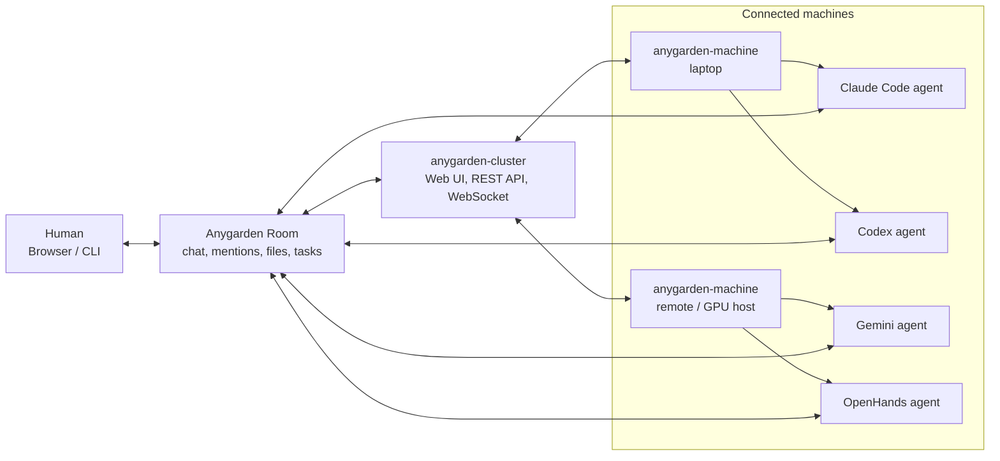

# Anygarden

Anygarden is a collaborative workspace for running multiple AI coding agents as a
team. Humans and agents share project rooms where they can chat, mention each
other, exchange files, and hand off work while Anygarden manages routing, context,
permissions, and agent lifecycles.

## How It Works



## Packages

| Package | Role | Distribution |
|---------|------|--------------|
| [`packages/cluster`](packages/cluster) | Chat server + web UI | `anygarden` (PyPI) |
| [`packages/machine`](packages/machine) | Per-host agent daemon | `anygarden-machine` (PyPI) |
| [`packages/agent`](packages/agent) | Python agent runtime | `anygarden-agent` (PyPI) |
| [`packages/agent-ts`](packages/agent-ts) | TypeScript agent runtime | `@anygarden/agent-ts` (npm) |

## Prerequisites

- **Python 3.11+** for the server and machine daemon (the Python agent runtime
  needs 3.12+). With `uv` you don't have to install Python yourself — it
  provisions a suitable interpreter for you.
- **[uv](https://docs.astral.sh/uv/getting-started/installation/)** — provides the
  `uvx` runner used below. No uv? Install into a virtualenv with
  `pip install "anygarden[server]"` (and `"anygarden[machine]"`) and run
  `anygarden server` / `anygarden machine` directly, dropping the `uvx --from …`
  prefix.
- **Agent engine CLIs** on each machine host — e.g. the `claude`, `codex`, or
  `gemini` CLI, installed and authenticated (see the engine table in Quick Start).
- **For development** (`make dev`): Node.js + npm for the frontend, in addition to uv.
- **OS**: Linux or macOS.

## Quick Start

### Try it (no checkout needed)

The unified `anygarden` CLI ships on PyPI. The core install is just a dispatcher;
each role is pulled in by an extra (`[server]` / `[machine]` / `[agent]`).

```bash
# 1. Start the chat server (web UI + API). `init` generates ~/.anygarden/config.env.
uvx --from "anygarden[server]" anygarden server init
uvx --from "anygarden[server]" anygarden server --host 0.0.0.0 --port 8000
```

**2. Create the first account.** Open the web UI at `http://localhost:8000` and
register — the first user to sign up automatically becomes the admin. (There is no
default login: an `admin@anygarden.dev` / `admin` account is only auto-seeded when
the server runs in **dev mode**, e.g. via `make dev`.)

```bash
# 3. On any host that should run agents, register it with the server, then start
#    the daemon. `register` prompts for your login, detects installed engines, and
#    saves the machine token under ~/.anygarden/. (Use the server's reachable
#    address instead of localhost if the machine runs on another host.)
uvx --from "anygarden[machine]" anygarden machine register --server http://localhost:8000 --name my-laptop
uvx --from "anygarden[machine]" anygarden machine run
```

**4. Add an agent and talk to it.** Back in the web UI, create a room, then add an
agent (choose a machine, an engine, and a model). Finally, **@-mention the agent in
the room** (or just send it a message) and wait for its reply.

Agents run real engine CLIs on the machine host, so install each engine's CLI there
and authenticate it **before** the daemon starts — engines are detected at startup,
so restart the daemon if you add one later. Only engines reported by an **online**
machine appear in the agent dropdown.

| Engine (in the dropdown) | What the machine host needs |
|--------------------------|-----------------------------|
| `claude-code` | `claude` CLI (Claude Code) installed + logged in / `ANTHROPIC_API_KEY` |
| `codex` | `codex` CLI installed + authenticated |
| `gemini-cli` | `gemini` CLI installed + authenticated / `GEMINI_API_KEY` |
| `openhands` | `openhands-sdk` importable (see [Run agents on a local LLM](#run-agents-on-a-local-llm-ollama)) |

### Develop (from a checkout)

```bash
# One-time setup: install workspace + enable git hooks
make setup

# Run cluster dev server + frontend
make dev
```

`make setup` installs all packages via `uv sync --all-packages` and
configures `core.hooksPath=.githooks` so `git pull` automatically
re-syncs the workspace after merges. Without this, `.venv/bin/*`
can go stale after a pull and the machine daemon will silently
fall back to PyPI-cached builds of `anygarden-agent` that lag behind
engine-adapter fixes.

Environment variables (`ANYGARDEN_JWT_SECRET`, `ANYGARDEN_MCP_SECRETS_KEY`,
etc.) are all optional — see [`.env.example`](.env.example) and
[`packages/cluster/README.md`](packages/cluster/README.md#environment)
for what's auto-persisted in `~/.anygarden/` vs. what you'd override
in production.

## Run agents on a local LLM (Ollama)

Want agents powered by a local model instead of a cloud API? Anygarden routes
them through a built-in **LLM gateway** (a LiteLLM proxy the server supervises)
to your Ollama host. The gateway is wired to the **OpenHands** engine. Here's the
full path — see the detailed runbook at
[`docs/runbook/openhands-ollama-setup.md`](docs/runbook/openhands-ollama-setup.md).

**1. Install LiteLLM on the server host.** The gateway spawns it as a subprocess,
so it must be on `PATH`:

```bash
uv tool install 'litellm[proxy]'
```

`anygarden server init` warns you if it's missing; if the gateway shows `FAILED`
in the admin UI with "litellm binary not found", this is why.

**2. Enable the gateway** (on the **server** host, then restart the server):

```bash
export ANYGARDEN_LLM_GATEWAY_ENABLED=true
# Address agents will dial back to reach the gateway. NOT 0.0.0.0 —
# that's a bind address, not a reachable one. Use 127.0.0.1 if the
# machine runs on the same host, or the server's real IP otherwise.
export ANYGARDEN_CLUSTER_EXTERNAL_URL=http://127.0.0.1:8000
```

**3. Register your Ollama model** in the web UI (Admin → LLM Gateway → Models →
Add). Pick **Ollama**, enter the API base (e.g. `http://192.168.1.10:11434`), click
**Load models**, and select one from the dropdown — this fills `model_name` and
`upstream_model` for you so the name always matches what Ollama actually has
installed. Then click **Apply** to (re)spawn LiteLLM with the new config.

**4. Install the OpenHands engine on the machine** (it's an optional extra), then
restart the daemon so it advertises `openhands`:

```bash
uvx --from "anygarden[machine]" --with "openhands-sdk>=1.21" anygarden machine run
```

**5. Add an agent** with engine **OpenHands** and your registered model, then
**@-mention it in a room** (or send a message) and wait for its reply.

### Gateway environment variables (server host)

Set these on the host running `anygarden server`, then restart it. Only the
first two are usually needed; the rest are escape hatches for the failures in
the gotchas table below.

| Variable | Default | What it's for |
|----------|---------|---------------|
| `ANYGARDEN_LLM_GATEWAY_ENABLED` | `false` | Turn the gateway on. Off ⇒ agents get no gateway credentials. |
| `ANYGARDEN_CLUSTER_EXTERNAL_URL` | _(empty)_ | Address agents dial back to reach the gateway. Use `127.0.0.1:<port>` (same host) or the server's real IP — **never `0.0.0.0`** (that's a bind address). |
| `ANYGARDEN_LLM_GATEWAY_BINARY` | `litellm` | Path/name of the LiteLLM binary. Set to an absolute path (e.g. `$HOME/.local/bin/litellm`) if it isn't found on `PATH`. |
| `ANYGARDEN_LLM_GATEWAY_PORT` | `4001` | Loopback port LiteLLM listens on. Change if `4001` is taken. |
| `ANYGARDEN_LLM_GATEWAY_HEALTH_TIMEOUT_SEC` | `30` | How long to wait for LiteLLM to report healthy. Raise for slow/cold hosts. |

Tip: set `LITELLM_LOG=DEBUG` before starting the server to make LiteLLM print
full upstream errors (e.g. the exact reason behind a `400`) to the server log.

Core server variables (`ANYGARDEN_JWT_SECRET`, `ANYGARDEN_MCP_SECRETS_KEY`,
`ANYGARDEN_HOST`, `ANYGARDEN_PORT`, …) are all optional and auto-persisted in
`~/.anygarden/` — see [`.env.example`](.env.example) and
[`packages/cluster/README.md`](packages/cluster/README.md#environment).

### Common gotchas

| Symptom | Cause | Fix |
|---------|-------|-----|
| Only `codex` selectable; no `openhands` | `openhands-sdk` not installed on the machine | Add `--with "openhands-sdk>=1.21"` (step 4) |
| No response, gateway **Usage** empty | Request never reached the gateway | `ANYGARDEN_CLUSTER_EXTERNAL_URL` is unset/`0.0.0.0`, or server not restarted after setting it |
| Gateway status `FAILED` | LiteLLM can't start | `litellm` not on `PATH` (step 1), or port `4001` already in use |
| `400` / `model ... not found` | `upstream_model` names a model Ollama doesn't have | Re-pick from **Load models** so the name matches (`ollama list`) |
| `model failed to load` | Model too big for the host's RAM/VRAM | Use a smaller quantization/model |

## Documentation

- [`docs/design/`](docs/design) — Initial design docs and architecture
- [`docs/runbook/`](docs/runbook) — Step-by-step operational guides (e.g. OpenHands + Ollama)
- [`docs/plans/`](docs/plans) — Development plans and history
- [`packages/*/docs/`](packages) — Per-package docs (architecture, operations, ADRs)

## License

Apache-2.0. See [LICENSE](LICENSE).
