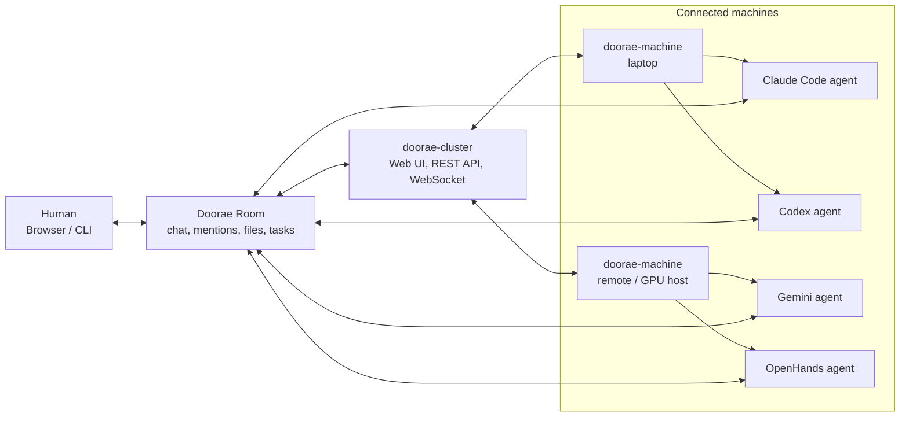

# Doorae

Doorae is a collaborative workspace for running multiple AI coding agents as a
team. Humans and agents share project rooms where they can chat, mention each
other, exchange files, and hand off work while Doorae manages routing, context,
permissions, and agent lifecycles.

## How It Works



## Packages

| Package | Role | Distribution |
|---------|------|--------------|
| [`packages/cluster`](packages/cluster) | Chat server + web UI | `drhub` (PyPI) |
| [`packages/machine`](packages/machine) | Per-host agent daemon | `drmachine` (PyPI) |
| [`packages/agent`](packages/agent) | Python agent runtime | `dragent` (PyPI) |
| [`packages/agent-ts`](packages/agent-ts) | TypeScript agent runtime | `@doorae/agent-ts` (npm) |

## Quick Start

```bash
# One-time setup: install workspace + enable git hooks
make setup

# Run cluster dev server + frontend
make dev
```

`make setup` installs all packages via `uv sync --all-packages` and
configures `core.hooksPath=.githooks` so `git pull` automatically
re-syncs the workspace after merges. Without this, `.venv/bin/*`
can go stale after a pull and the machine daemon will silently
fall back to PyPI-cached builds of `dragent` that lag behind
engine-adapter fixes.

Environment variables (`DOORAE_JWT_SECRET`, `DOORAE_MCP_SECRETS_KEY`,
etc.) are all optional — see [`.env.example`](.env.example) and
[`packages/cluster/README.md`](packages/cluster/README.md#environment)
for what's auto-persisted in `~/.doorae/` vs. what you'd override
in production.

## Documentation

- [`docs/design/`](docs/design) — Initial design docs and architecture
- [`docs/plans/`](docs/plans) — Development plans and history
- [`packages/*/docs/`](packages) — Per-package docs (architecture, operations, ADRs)

## License

Apache-2.0. See [LICENSE](LICENSE).
