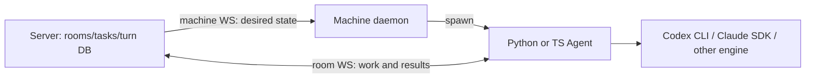
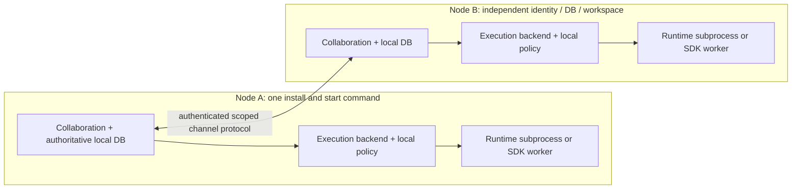
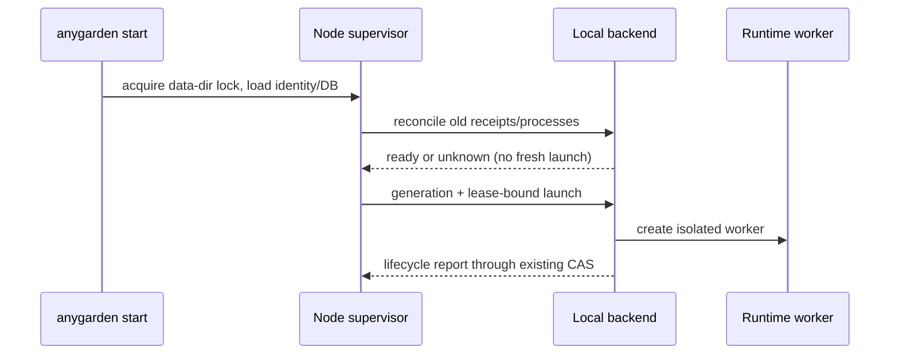

# 7. Independent nodes and single-authority shared channels

Implements the design deliverable of #587 under #586. Baseline freshly verified:
`66235f332f6538bceb1591f1c8b12bde4dbbb7ef`. This document and the executable
contract examples are **not an implemented federation service, transport security
proof, runtime compatibility certification, or two-node acceptance result**.

## Current code and target





| Existing source | Preserve | Adapt in later issues |
|---|---|---|
| `packages/cluster/anygarden/cli.py` | Existing server/machine/agent commands | #588 adds unified start/stop |
| `scheduler/lifecycle.py`, `scheduler/machine_bus.py` | generation, desired state, dispatch lease, ACK checks | #588 local backend; no direct DB bypass |
| `packages/machine/anygarden_machine/daemon.py`, `spawner.py` | process tree supervision, local materialization | #588 remove network requirement from local path |
| `task_service.py` | one-DB atomic claim and status CAS | #592 routes shared mutations to channel authority |
| `turns/service.py` | durable outbox, generation/attempt/lease fencing, completion CAS | #589/#592 execution adapter and receipt linkage |
| `workspaces/` | local consent, attachment epoch, revocation, write restrictions | no remote policy override |
| `packages/agent/anygarden_agent/integrations/codex_cli.py` | CLI invocation and JSONL parser | #589 remove ChatClient dependency and unsafe resume fallback |

PR583 changes lifecycle/daemon report concurrency, PR584 adds E2E, PR585 changes
release gating. They remain outside this baseline and need explicit integration
review when their overlapping code is adopted; this ADR does not authorize merge.

## Local node and execution interface (#588 / #589)

`anygarden start` runs the unified node in the foreground; `anygarden stop`
requests graceful shutdown of the owner of the same data directory. Existing
`server`, `machine`, `agent`, `client` commands keep their current behavior.
Existing data requires an explicit backup/migration procedure; startup must not
silently initialize a second DB or run destructive migrations.

`node_id` is an immutable UUID persisted with the node data directory, unrelated
to hostname, URL or Machine PK. A local Machine row remains an internal mapping
for existing foreign keys. DB/identity backup is restored together; a cloned
installation must get a new node identity before connecting. URL/key rotation
does not change identity; accepted key rotation requires local admin confirmation
in v1. No automatic authority failover or identity duplication is supported.

Integrated mode supports one API worker. Multiple workers are rejected; multi-worker IPC is deferred. Reload is rejected unless ownership release and child cleanup are tested. Existing server command behavior is preserved.

A process-lifetime OS lock protects the data directory. A second start fails;
PID files alone are insufficient. An independently started daemon cannot own
the integrated local Machine. A stop endpoint is local-owner authenticated,
never an unauthenticated network endpoint. Stop drains/cancels work, persists
receipts, reaps owned process trees and releases the lock last. Startup checks
remaining children/receipts before allowing a new execution. Unverifiable old
execution becomes `unknown`; it is never blindly spawned again.

The existing MachineBus-shaped boundary may be retained:

```python
class ExecutionBackend(Protocol):
    async def send(self, machine_id: str, frame: dict) -> bool: ...
    def is_connected(self, machine_id: str) -> bool: ...
    def connected_ids(self) -> set[str]: ...
```

`True` means delivery accepted, not process started or work completed. Local
ACK/report callbacks pass through the same lifecycle conditional updates as
remote reports (placement, generation, desired state, dispatch lease/token).
Local and network backends must never both dispatch for the same Machine.

The runtime boundary for #589 is `capabilities()`, `start(invocation)`,
`events(execution_id)`, `cancel(execution_id)`, `reconcile(execution_id)`.
Invocation IDs and receipts are durable local execution-manager data; adapters
do not claim tasks or decide retries. Cancellation returns a request receipt;
only confirmed process-tree termination yields `stopped`. Runtime capability
flags include progress, cancel, resume, and workspace enforcement. Unsupported
capabilities fail explicitly, never degrade silently to a broader permission.

## Identity and authority

All IDs in the wire examples are UUIDs. Agent identity is the tuple
`(node_id, agent_id)`; human identity uses `(node_id, user_id)` through the same
principal shape. Display names are never authentication identities. Channel
identity is `(authority_node_id, channel_id)`. Remote IDs map to local mirror
rows explicitly, never by reusing a foreign node's primary key.

Each shared channel has exactly one immutable authority in v1. It owns message
sequence, membership grants, thread roots, task originals, claim/complete/cancel
ordering and final task projection. A mirror cannot run the local task CAS to
confirm a shared mutation. Execution nodes own local consent, agent exports,
workspace/policy/credential access, process state and execution receipts.
Neither authority implies the other. Local channels have no federation export.

Shared Task status keeps the existing `todo/in_progress/blocked/done/failed`
vocabulary. The separate delegation record has `requested/accepted/running/
cancel_requested/completed/rejected/cancelled/unknown`. The UI also distinguishes
an **unconfirmed submission** from an authority-committed `requested` record.
`requested` refers to an existing authority-owned source-linked Task and reserves one target agent at the authority; `accepted` commits its
claim (`in_progress`), but cannot start until execution node durably observes
that authority decision. `cancelled` is a delegation terminal; its Task projects
to `failed` with a cancellation reason, not a newly invented Task status.

## Peer admission, scope and revocation (#590)

V1 uses explicit HTTPS addresses and mutual TLS with peer certificates pinned
to immutable node identity after local admin approval. No discovery/relay/NAT
traversal. Local provider-free tests use isolated loopback transports only;
production cannot silently fall back to plaintext or disable peer verification.
Never forward credentials on redirects. User-supplied peer URLs require an
explicit admin-approved endpoint policy to prevent SSRF (including redirects,
DNS changes and metadata endpoints); private addresses are allowed only by that
local policy, not through arbitrary remote input.

Invite lifecycle: `pending -> accepted | rejected | expired | revoked`.
An invite is single-use, expiring, bound to issuer, intended node/certificate
fingerprint and proposed channels/scopes. Redemption and key pinning are atomic;
replay returns an already-consumed result, never another grant. Both nodes
approve their own exposure; accepting a peer grants no ambient room listing,
host shell, machine administration or runtime credentials.

A grant binds peer + channel + exported principal set + capabilities
(`channel.read`, `message.send`, `task.request`, `task.execute`, `task.cancel`)
with expiry and monotonically increasing `grant_epoch`. This envelope references
the **authority-issued channel grant epoch**, shared on that channel; execution
nodes additionally check their own local consent/policy epoch without putting
it into the authority namespace. Scope is intersected with current room role,
archive state, export policy and local workspace approval. Revalidate on every
request, replay, delivery, execution start and result acceptance. Authenticate
transport identity and compare it to the claimed sender before dedup lookup.

Revocation advances the epoch and stops new reads/writes/dispatch immediately
at the revoking node. A durable control event informs the peer; local removal
kills/drains affected executions and invalidates session bindings. Already
shared data cannot be clawed back. During a partition the other node cannot
know instantly: no new shared start is permitted without current authority
confirmation; an already running process may continue until its local deadline,
revocation delivery, or local stop. Cancellation stays unconfirmed until proof.
Results arriving under revoked grants are rejected; only bounded local audit
receipts remain. Re-invitation requires a new grant, never revives old requests.

## Versioned wire contract and APIs (#590–592)

Normative envelope and payload shapes: `contracts/federation/v1/envelope.schema.json`.
Unknown fields/kinds and protocol versions are rejected. First version is exactly
`protocol_version=1`; no implicit downgrade. `hello`/local peer configuration
must establish version 1 before channel traffic; capabilities cannot grant access.

Proposed endpoint contract (not currently mounted routes):

| API | Caller / owner | Meaning |
|---|---|---|
| `POST /api/v1/node/invites` | local admin | create bounded pinned invite |
| `POST /api/v1/node/invites/{id}/accept` | local admin at invited node | approve local scope and redeem on issuer |
| `DELETE /api/v1/node/peers/{node_id}` | local admin | revoke local relationship/exports and propagate control |
| `POST /api/v1/federation/channels/{channel_id}/commands` | mutually authenticated member to authority | envelope; returns durable receipt or closed error |
| `GET /api/v1/federation/channels/{channel_id}/events?after_seq=N` | authorized member to authority | ordered durable events, bounded page (max 100) |
| `POST /api/v1/federation/channels/{channel_id}/acks` | authorized member to authority | highest contiguous committed event cursor |

Membership/peer lifecycle are control-plane operations, not generic `message.send`
payloads. #590 must supply their route models/tests before implementation is GO.
This version's executable examples cover channel envelopes, not certificate
cryptography or invite HTTP handlers. Responses use HTTP 400 invalid schema,
401 unauthenticated, 403 scoped authorization denial, 409 state/ID conflict,
426 incompatible protocol, 503 authority unavailable. Errors never include
remote paths, credentials, raw stderr or full submitted bodies.

`request_id` is sender-generated and stable over transport retries. Dedup key is
`(sender_node_id, authority_node_id, channel_id, request_id)`. Same semantic body
and envelope returns the stored receipt; same key with changed content is
`ID_CONFLICT`. The receiver computes canonical content (sorted JSON object keys,
compact UTF-8, no floats/NaN, no duplicate object keys) and compares stored bytes,
not a client-supplied digest. JSON property order changes do not create new work.

Authority allocates `event_id` and contiguous channel `seq` in the transaction
that commits command receipt + state CAS + outbox event. Crash before commit
means no ACK; lost ACK means resend same request, not new execution. Followers
ACK only after their inbox dedup + projection + cursor commit. Delivery is at
least once. An event ID with changed bytes or reused sequence with another event
is an integrity error. A gap pauses projection, requests missing events, and
never advances the ACK cursor past the gap. Keep receipts/tombstones for channel
lifetime in v1; resetting cursor or dropping dedup history requires an explicit
resync protocol, not automatic replay into a fresh DB.

Message sequence and thread root are authority-local; a thread references an
existing root in the same channel. Cross-channel roots fail. Message envelopes
contain only selected text and explicit shared IDs; no automatic history,
credentials, workspace paths, runtime session handles or attachment replication.

## Delegation transitions and races

Every mutation includes expected `revision`; authority updates delegation state,
revision, task ownership and outbox atomically. Request payload's executor is a
node-scoped exported agent. Runtime input comes from explicit task/message
references, not arbitrary shell commands or caller-supplied local paths.

| Command and actor | Before → after | Required guard |
|---|---|---|
| task.request / permitted requester | absent → requested | expected revision 0; target exported; task reservable |
| task.accept / selected executor | requested → accepted | fresh local consent and authority reservation; claim CAS |
| task.reject / selected executor | requested → rejected | no process started |
| task.started / selected executor | accepted → running | matching execution ID; durable start receipt |
| task.result / selected executor | accepted or running → completed | same execution, revision, attempt; valid grant; completion CAS |
| task.cancel / original requester or channel admin | requested/accepted/running/unknown → cancel_requested | revoke new-start permission before sending cancel |
| task.cancelled / selected executor | cancel_requested → cancelled | confirmed `not_started` or `stopped` process state |
| task.unknown / selected executor | accepted/running/cancel_requested → unknown | cannot prove execution outcome; no automatic retry |

The executor proposes a unique `execution_id` in accept; the authority binds it
per delegation. Local durable mapping from delegation to this ID is written
before launch. Claim accepted but ACK missing: reconcile the same receipt. Crash
between start intent and child observation: `unknown`, not another process.
Multiple claims compete in the authority transaction; one wins, losers get 409.
Distinct request IDs cannot bypass delegation identity/revision/terminal guards.

If result commits first, cancellation fails as terminal. If cancellation commits
first, result fails `CANCEL_PENDING`; process confirmation must still arrive. Authenticated late results produce a bounded local observation receipt (execution ID + reason only), but never promote the task to completed or republish the result. This preserves evidence that side effects may already have happened. Process state is tracked independently from delegation state.
`cancel_requested` never means stopped. `unknown` never means success or permission
to replay. A human may reconcile an unknown result or authorize a **new**, audited
delegation after checking side effects; v1 has no automatic retry transition.
Transport duplicates of a successful result get the old receipt without another
visible message. Late attempts, stale grant epochs/revisions and changed body
reuse fail closed. External tool effects cannot be made exactly-once by this
protocol; only authority state/result publication is at most once.

## Sequence examples



```mermaid
sequenceDiagram
  participant U as Requester
  participant A as Channel authority
  participant B as Execution node
  participant R as Runtime
  U->>A: task.request (stable request ID)
  A-->>B: committed request event
  B->>A: task.accept (local consent + execution ID)
  A-->>B: committed claim receipt
  B->>B: persist start intent, recheck local policy
  B->>R: invoke once
  R-->>B: progress / result
  B->>A: task.result (revision + execution ID)
  A-->>U: committed completion event
  Note over A,B: Lost ACK: resend same ID. Authority offline: retain unconfirmed outbox; no fresh shared start.
```

## Session scope, migration and first runtime

Select `codex-cli` first because the repository already invokes a separate CLI,
parses structured events and stores native resume handles. `Agent.runtime`
(`python|typescript`) is the legacy wrapper implementation language, **not** the
engine identifier. Do not overload that DB field with `codex-cli`.

Session key is `(execution_node_id, agent_id, authority_node_id, channel_id,
thread_root_id-or-main, workspace_binding_id, workspace_epoch, policy_epoch,
engine, engine_version)`. Never send native handles to peers or reuse a session
across channels/threads/workspace epochs. Explicit task IDs bind individual turns
within that scope; concurrency is serialized per session. Membership/export or
policy changes retire the binding to prevent prior private context leaking.
Legacy room-only session files are quarantined on migration: do not import them
into shared scopes. Start fresh only for a new, explicitly accepted invocation,
not by replaying a possibly completed old turn.

Current `codex_cli._call_codex` retries any nonzero resumed invocation as a new
session; #589 must remove that broad retry in the new path. Only a proven
pre-execution session-not-found outcome can permit a separately recorded fresh
attempt; otherwise surface `unknown` and require reconciliation.

Historical smoke image pins CLI 0.146.0; this is fixture provenance only. PM
reports host CLI 0.154.0; **no actual supported-version claim is made here**.
#589 must pin the first supported CLI version after provider-free argument,
JSONL, cancellation and session-restart checks. Live provider success remains
separate (#578). Until then capabilities are design targets: progress from
allowlisted JSONL events; cancellation from supervised process-tree termination;
resume only within the exact scope; external workspace writes remain disabled
unless existing local enforcement requirements are proved. Parsing a recorded
fixture does not certify a current CLI or model. Tokens/credentials stay local.

## Deliverables, implementation ownership and limits

- This change: ADR, envelope schema, normal/adversarial fixtures and a pure
  deterministic reference checker in `contracts/federation/v1/`.
- #588: developer owns CLI/lifespan/local backend and lifecycle integration.
- #589: adapter developer owns invocation/receipts/session migration.
- #590: peer auth, invite lifecycle and durable grant revocation.
- #591: transactional receipt/event/outbox/inbox and replay APIs.
- #592: authoritative task projection plus executor coordination.
- #593: UI must show unconfirmed submission, authority/executor offline,
  cancellation pending and unknown outcome separately.
- #594: independent durable two-node harness; its tests must distinguish
  reference-model validation from exercising actual product implementations.

The contract checker is in-memory and single-threaded. It tests decisions and
fixtures only, not SQL atomicity, fsync, TLS, race linearizability, process kill,
network partitions or external provider behavior. These remain explicit
implementation acceptance gates. No deployed schema or service is changed.
