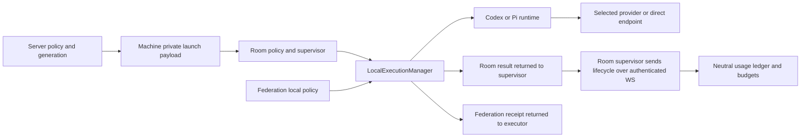

# 8. Two-engine Runtime contract and direct endpoint configuration

Supersedes [ADR-004](./004-embedded-litellm-gateway.md) and the historical
OpenHands adoption plan in [ADR-005](./005-openhands-validation-plan.md).
This records the implementation direction of [#652](https://github.com/e7217/anygarden/issues/652)
and the documentation deliverable [#661](https://github.com/e7217/anygarden/issues/661).

## Decision and implementation

The supported engines are `codex-cli` and `pi-cli`, using the Python agent runtime.
Gemini, OpenHands and Claude Code adapters, including TypeScript Claude execution,
are removed. Existing configurations and historical usage remain intact; startup
is refused with migration guidance instead of silently converting an agent.
See [retired engines](../runbook/retired-engines.md).

Both normal room turns and federation use the Runtime protocol (`capabilities`,
`run`) behind LocalExecutionManager (`start`, `events`, `cancel`, `reconcile`).
Room registration retains existing wake policy, supervision and input context.
Only the trusted local registration factory selects room runtimes that preserve
staged Codex OAuth, MCP, skills and permission settings. Federation payloads cannot
enable this mode and retain the isolated runtime contract. Pi config and session
directories remain separate per agent; its tool restrictions are not an OS sandbox.

## Direct endpoints and secrets

Administrators configure provider, model, base URL, protocol and credential
reference together. Codex requires the Responses protocol; Pi supports Responses
and Chat Completions. Chat Completions compatibility alone is insufficient for
Codex. Pi provider IDs are required and accept custom identifiers matching
`^[A-Za-z0-9][A-Za-z0-9._-]{0,63}$`.

Credentials use encrypted storage and private stdin delivery, then the selected
child process environment. API responses and generated files contain references,
not secret values. Pi's managed models.json uses an environment-variable reference;
selected-provider auth conflicts and externally modified files cause explicit
refusal. Cold machine restart requires fresh authenticated configuration.
See [direct endpoint setup](../runbook/direct-model-endpoints.md).

Endpoint selection and credential revision are included in execution fingerprints
and session identity, independently of generation. Legacy Codex sessions are
imported only once and only when native provider/model/workspace metadata proves
compatibility. Unknown sessions are preserved as files and a new session begins.
See [room upgrade behavior](../runbook/room-execution-upgrade.md).

## Usage and cancellation

The neutral `usage_ledger` preserves prior rows and budget consumers. Measured
usage survives success, provider failure, timeout and cancellation. Execution
cancellation sends terminal lifecycle events while keeping the room WebSocket
alive; actual handler-task cancellation retains separate cleanup semantics.

The existing writer remains best-effort and non-idempotent: repeated lifecycle
frames can double count. One terminal event per tested invocation does not promise
replay deduplication or delivery across network failure.

## Gateway retirement and unresolved relay requirement

The OpenHands gateway consumer is removed. The embedded gateway service/API itself
is a separate retirement change in [#659](https://github.com/e7217/anygarden/issues/659).
Usage aggregation must remain available through a neutral API/UI when it is removed.
Historical gateway configuration and encrypted secret rows must be retained.

Direct endpoints do not replace the old proposal that an air-gapped machine could
borrow another machine's internet access. Whether a relay is still needed remains
an explicit open decision; no new relay is implemented or implicitly promised.

## Verification and limits

Independent local tests cover actual room registration, runtime supervision,
loopback HTTP endpoint selection, authenticated TCP WebSockets, durable turn/lease
validation and SQLite usage/budget recording. Both engines cover success, failure,
timeout and cancellation. Cancellation preserves measured usage and permits the
next turn on the same connection. Invalid leases cannot append usage.

These tests use fake engine executables. Installed CLI version gates were checked,
but this change does not claim an installed CLI completed a real model turn or
that actual OAuth/MCP/skills integrations were exercised end to end. Historical
federation canary evidence is distinct from this room validation. Hosted CI and
production deployment are separate from local acceptance.

## References

- [#653](https://github.com/e7217/anygarden/issues/653): common room execution
- [#654](https://github.com/e7217/anygarden/issues/654): Pi registration/provider
- [#655](https://github.com/e7217/anygarden/issues/655): neutral ledger
- [#656](https://github.com/e7217/anygarden/issues/656), [#657](https://github.com/e7217/anygarden/issues/657), [#658](https://github.com/e7217/anygarden/issues/658): engine retirement
- [#660](https://github.com/e7217/anygarden/issues/660): direct endpoints
