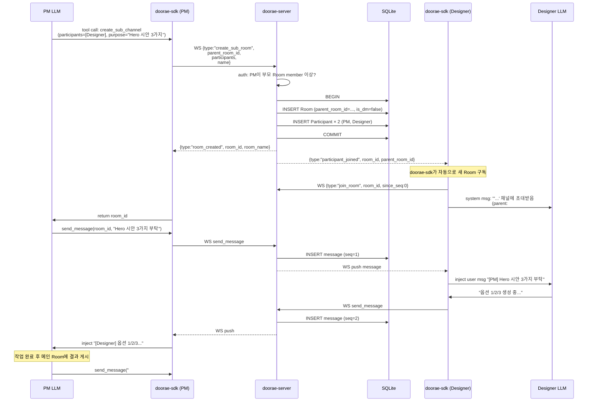

# 03. 채널 기반 서브에이전트

> **한 줄 요약**: 서브에이전트는 에이전트 엔진이 spawn하는 프로세스가 아니라, 두 에이전트가 공유하는 **작은 Room**이다. SQLAlchemy `Room.parent_room_id` 컬럼 하나로 구현된다.

Plan A §7과 EP00 §3에서 확정된 이 패턴을 **SQLAlchemy 구현 관점**에서 재정리한다. 서버 코드 변경은 `models.py` ~10줄 + `rooms/service.py` ~30줄 = 총 **~40줄**이다.

---

## 3.1 핵심 원칙 (변경 불가)

1. **서브에이전트 = 전용 Room 채널**. 새로운 엔티티 타입이 아니다.
2. **관계는 Room에만 존재**. `Agent.parent_agent_id`는 **없다**. 모든 에이전트는 동등한 peer.
3. **엔진별 spawn API는 사용하지 않는다**. Claude Code SDK의 `subagent`, Deep Agents의 `SubAgentMiddleware` 등 어느 것도 호출하지 않는다.
4. **이종 엔진 혼용이 자연스럽다**. Claude Code 부모가 Codex 자식에게 일을 맡기는 것이 "서브 Room에 둘이 같이 들어가 대화하는 것"일 뿐이다.
5. **서버는 계층 깊이를 강제하지 않는다**. 자식 Room이 또 자식 Room을 만들 수 있다 (무한 깊이, 앱 레이어 제약 가능).

---

## 3.2 SQLAlchemy 모델 (`doorae/db/models.py` 발췌)

```python
from __future__ import annotations
import uuid
from datetime import datetime
from sqlalchemy import ForeignKey, String, Boolean, CheckConstraint, Index
from sqlalchemy.orm import Mapped, mapped_column, relationship
from doorae.db.models import Base  # DeclarativeBase


class Room(Base):
    __tablename__ = "rooms"

    id: Mapped[uuid.UUID] = mapped_column(primary_key=True, default=uuid.uuid4)
    project_id: Mapped[uuid.UUID] = mapped_column(ForeignKey("projects.id"))
    name: Mapped[str] = mapped_column(String(200))

    # 핵심: 두 컬럼으로 모든 Room 종류 표현
    parent_room_id: Mapped[uuid.UUID | None] = mapped_column(
        ForeignKey("rooms.id"),
        nullable=True,
        index=True,
    )
    is_dm: Mapped[bool] = mapped_column(Boolean, default=False)

    archived: Mapped[bool] = mapped_column(Boolean, default=False)
    created_at: Mapped[datetime] = mapped_column(default=datetime.utcnow)

    # Self-referential relationship
    parent: Mapped[Room | None] = relationship(
        "Room",
        remote_side="Room.id",
        back_populates="children",
    )
    children: Mapped[list[Room]] = relationship(
        "Room",
        back_populates="parent",
    )

    __table_args__ = (
        # 자기 자신이 부모가 되는 루프 금지
        CheckConstraint(
            "parent_room_id IS NULL OR parent_room_id <> id",
            name="rooms_no_self_parent",
        ),
        # 서브 채널 빠른 조회
        Index(
            "idx_rooms_parent_not_null",
            "parent_room_id",
            postgresql_where=("parent_room_id IS NOT NULL"),
            sqlite_where=("parent_room_id IS NOT NULL"),
        ),
    )
```

**구현 포인트**:

- `room_type: Literal["main","sub","dm"]` 같은 문자열 컬럼은 **만들지 않는다**. Plan A §4.2 결정 2에 따라 파생 필드이므로 정규화 위반이다.
- Room의 의미는 **다음 표가 유일한 정의**이다:

| 의미 | `parent_room_id` | `is_dm` | 예시 |
|---|---|---|---|
| 루트 Room (일반) | `NULL` | `False` | `#sprint-42` |
| 서브 채널 | `NOT NULL` | `False` | `#sprint-42/pm-designer` |
| 1:1 DM | `NULL` | `True` | `Alice ↔ Bob` |
| 서브 DM (드문 경우) | `NOT NULL` | `True` | 허용하되 UI는 일반 서브 채널로 취급 |

---

## 3.3 서비스 레이어 (`doorae/rooms/service.py` 발췌)

서브 Room 생성 시 권한 상속과 참여자 자동 추가를 처리한다.

```python
# doorae/rooms/service.py
from uuid import UUID
from sqlalchemy import select
from sqlalchemy.ext.asyncio import AsyncSession
from doorae.db.models import Room, Participant
from doorae.rooms.errors import NotMember, RoomNotFound, SubRoomLoopError


async def create_sub_room(
    db: AsyncSession,
    *,
    parent_room_id: UUID,
    name: str,
    participants: list[UUID],  # user or agent ids (실구현 시 list[tuple[UUID, "user"|"agent"]] 또는 spec dataclass로 kind 명시 권장 — UUID만으로는 판별 불가)
    creator_participant_id: UUID,
    is_dm: bool = False,
) -> Room:
    # 1. 부모 Room 확인
    parent = await db.get(Room, parent_room_id)
    if parent is None:
        raise RoomNotFound(parent_room_id)

    # 2. 자기 자신을 부모로 지정하는 즉각적 self-reference를 앱 레벨에서도 차단
    #    (DB CHECK도 같은 것을 막지만 방어 심층화)
    #    깊이 2 이상은 허용. 일반 사이클 방지가 필요하면 별도 재귀 검증이 있어야 함.
    if parent.parent_room_id == parent_room_id:
        raise SubRoomLoopError()

    # 3. 생성자가 부모 Room의 member 이상인지 확인 (권한 상속)
    creator_parent_part = await db.execute(
        select(Participant).where(
            Participant.room_id == parent_room_id,
            Participant.id == creator_participant_id,
        )
    )
    creator = creator_parent_part.scalar_one_or_none()
    if creator is None or creator.role == "observer":
        raise NotMember(parent_room_id)

    # 4. 자식 Room 생성
    child = Room(
        project_id=parent.project_id,   # 프로젝트 스코프 상속
        name=name,
        parent_room_id=parent_room_id,
        is_dm=is_dm,
    )
    db.add(child)
    await db.flush()  # child.id 확보

    # 5. 참여자 자동 추가 (creator는 admin, 나머지는 member)
    for subject_id in participants:
        is_creator = subject_id == creator.subject_id
        db.add(
            Participant(
                room_id=child.id,
                subject_id=subject_id,
                subject_kind=_infer_kind(subject_id),  # user|agent 판별
                role="admin" if is_creator else "member",
            )
        )

    await db.commit()
    await db.refresh(child)
    return child
```

**권한 상속 규칙** (Plan A §7.6 재확인):

| 규칙 | 구현 지점 |
|---|---|
| 자식 Room은 부모와 동일한 `project_id` | `child.project_id = parent.project_id` |
| 부모의 `member` 이상만 자식 생성 가능 | `if creator.role == "observer": raise` |
| 부모의 `admin`은 자식 Room 열람 가능 (감사용) | `rooms/router.py`의 `list_rooms` 쿼리에서 확장 |
| 부모 Room 아카이브 시 자식도 자동 아카이브 | `archive_room` 재귀 호출 |

---

## 3.4 WebSocket 흐름

서브 채널 생성을 WebSocket 프레임으로 처리하는 시퀀스:



**키 포인트**:

1. PM 에이전트의 LLM이 **자발적으로** 서브 채널 생성을 판단한다. 서버가 강제하지 않는다.
2. SDK가 `create_sub_channel` tool을 LLM에 노출시킨다. LLM은 이를 네이티브 tool 인터페이스로 호출한다.
3. 서버는 단순히 INSERT하고 WebSocket으로 브로드캐스트할 뿐이다 — "서브 채널"이라는 개념을 모른다.
4. Designer SDK는 `participant_joined` 알림을 받으면 자동으로 새 Room에 `join_room` 프레임을 보낸다.
5. 이후 흐름은 일반 Room과 **완전히 동일**하다.

---

## 3.5 4종 엔진 동등성

채널 기반 서브에이전트가 **4종 엔진 모두에서 동일하게 동작하는 이유**:

| 엔진 | spawn API 존재 여부 | 이 구현에서 쓰는가 |
|---|---|---|
| Claude Code SDK | `subagent` 래퍼 존재 | **사용 안 함** — 채널 기반 |
| Codex SDK | 없음 | N/A — 채널 기반 |
| OpenHands | `MicroAgent` 개념 존재 | **사용 안 함** — 채널 기반 |
| Deep Agents | `SubAgentMiddleware` 존재 | **사용 안 함** — 채널 기반 |

**서버는 엔진 종류를 모른다**. `Agent.engine` 컬럼은 메타데이터일 뿐 라우팅에 쓰이지 않는다. 따라서:

- Claude Code PM이 Codex 자식에게 위임 → 작동 ✓
- OpenHands 부모가 Deep Agents 자식에게 위임 → 작동 ✓
- 4종 에이전트가 같은 서브 Room에서 대화 → 작동 ✓

**이 동등성이 "이종 엔진 혼용"의 근본 원리**다. spawn API로 구현하면 엔진별 어댑터가 N×M개 필요하지만, 채널 기반은 N+M이 된다 (N=엔진 수, M=도구 수).

---

## 3.6 구현 체크리스트

서버 구현 시 이 기능을 완성하기 위해 필요한 파일·함수·테스트:

### 서버 측

- [ ] `doorae/db/models.py`: `Room.parent_room_id`, `Room.is_dm` 추가 (~10줄)
- [ ] `doorae/db/migrations/versions/xxxx_add_parent_room_id.py`: Alembic 마이그레이션 (~15줄)
- [ ] `doorae/rooms/service.py`: `create_sub_room()` 함수 (~30줄)
- [ ] `doorae/rooms/errors.py`: `NotMember`, `RoomNotFound`, `SubRoomLoopError` (~10줄)
- [ ] `doorae/ws/handler.py`: `create_sub_room` 프레임 핸들러 (~15줄)
- [ ] `doorae/ws/protocol.py`: `CreateSubRoomFrame` Pydantic 모델 (~10줄)
- [ ] `doorae/rooms/router.py`: `GET /api/v1/rooms/{id}/children` 엔드포인트 (~15줄)

### SDK 측

- [ ] `doorae_sdk/client.py`: `create_sub_room()` 메서드 (~20줄)
- [ ] `doorae_sdk/tools.py`: `@expose_tool` 데코레이터로 LLM에 노출 (~30줄)
- [ ] `doorae_sdk/client.py`: `on_participant_joined` 이벤트 → 자동 subscribe (~15줄)

### 테스트

- [ ] `tests/test_sub_room_creation.py`: 정상 생성, 루프 금지, 권한 검증
- [ ] `tests/test_cross_engine_sub_room.py`: Claude + Codex 조합 시나리오 (mock LLM)
- [ ] `tests/test_sub_room_archive_cascade.py`: 부모 archive → 자식 자동 archive

**총 구현 분량**: 서버 ~100줄 + SDK ~65줄 = **~165줄**로 "채널 기반 서브에이전트" 기능이 완성된다. 엔진별 spawn 어댑터를 작성했다면 4×4 = 16배 이상이 됐을 것이다.

---

## 3.7 `create_sub_channel` tool이 LLM에 보이는 모습

SDK가 자동으로 다음과 같은 tool schema를 각 엔진에 주입한다:

```json
{
  "name": "create_sub_channel",
  "description": "다른 에이전트와 개인 채널을 만들어 작업을 위임한다. 메인 Room의 다른 참여자에게는 보이지 않는다.",
  "parameters": {
    "type": "object",
    "properties": {
      "participants": {
        "type": "array",
        "items": {"type": "string"},
        "description": "초대할 에이전트 이름 목록 (나 자신은 제외)"
      },
      "purpose": {
        "type": "string",
        "description": "채널 생성 목적 (기록용)"
      }
    },
    "required": ["participants", "purpose"]
  }
}
```

엔진별 tool 등록 방법:
- Claude Code: `@agent.tool` 데코레이터
- Codex: `session.register_tool(...)`
- OpenHands: `runtime.register_action(...)`
- Deep Agents: LangGraph `@tool` 데코레이터

SDK는 이 4가지를 `integrations/<engine>.py`에서 추상화한다. 에이전트 개발자는 `client.expose_sub_channel_tool()` 한 줄만 호출하면 된다.

---

## 3.8 라이프사이클

| 단계 | 트리거 | 동작 |
|---|---|---|
| **생성** | 부모 에이전트가 `create_sub_channel` 호출 | `INSERT rooms` + `INSERT participants` + `participant_joined` 브로드캐스트 |
| **활성** | 두 에이전트가 작업 논의 | 일반 Room 메시지 흐름과 동일 (`seq` 단조증가) |
| **요약** | 부모 에이전트가 메인 Room에 결과 게시 | 일반 `send_message` |
| **아카이브** | 부모 에이전트가 `archive_room(id)` | `archived=true`, 새 메시지 수신 차단, 히스토리 보존 |
| **삭제** | (선택) admin REST 호출 `DELETE /api/v1/rooms/{id}` | cascade delete (messages도 삭제) |

**아카이브 vs 삭제**:

- **아카이브**: 기본. 과거 대화를 검색할 수 있고, 감사 추적이 유지된다.
- **삭제**: 드물다. admin 권한 전용. 실수 방지를 위해 CLI에서 `--force` 플래그 요구.

같은 에이전트 쌍이 다시 협업해야 한다면 새 Room을 만드는 것이 기본이다. 기존 Room을 재활성화하는 것보다 단순하다.

---

## 3.9 정리

| 항목 | 값 |
|---|---|
| 데이터 모델 변경 | `Room.parent_room_id` + `Room.is_dm` (2 컬럼) |
| 서버 LOC 추가 | ~100줄 |
| SDK LOC 추가 | ~65줄 |
| 신규 엔티티 | 없음 (기존 `Room` 재사용) |
| 신규 API | `POST /api/v1/rooms` (parent_room_id 인자) + `ws create_sub_room` 프레임 |
| 엔진별 어댑터 | **필요 없음** (서버는 엔진을 모름) |
| 이종 엔진 혼용 | 자연스럽게 작동 |

**이 단순함이 Plan A의 가장 큰 무기다**. EP00/EP10에서 검증된 패턴이며, 이 구현에서도 그대로 차용한다.

---

## 3.N Machine 스케줄링 계층과의 상호작용

이 문서가 다룬 **채널 기반 서브에이전트**(런타임 채팅 구조)와 §10의 **Machine 스케줄링**(프로세스 배치)은 서로 직교한다.

| 관점 | 담당 |
|---|---|
| "PM과 Designer가 private 채널을 만든다" | 이 문서 — `parent_room_id`로 Room 생성 |
| "Designer의 subprocess가 어느 Machine에서 도는가" | [§10](10-machine-scheduler.md) — 스케줄러가 bin-pack으로 Machine 선택 |

### 예: PM이 Designer 서브에이전트를 동적으로 spawn하는 전체 흐름

1. **(§3)** PM 에이전트가 LLM 판단으로 "Designer가 필요하다" 결정
2. **(§10)** PM 에이전트가 관리 API로 Designer 에이전트를 선언적 생성:
   ```bash
   POST /api/v1/agents
   {
     "engine": "claude-code",
     "profile": "designer",
     "rooms": []  # 아직 Room 없음
   }
   ```
3. **(§10)** 서버 스케줄러가 Machine 선택 → 해당 Machine의 Daemon이 `uvx doorae-agent` subprocess spawn → Agent가 서버에 독립 WS 연결
4. **(§3)** PM 에이전트가 Designer와의 private 채널 생성:
   ```bash
   POST /api/v1/rooms
   {
     "name": "pm-designer-private",
     "parent_room_id": "sprint-42-id",
     "is_dm": true,
     "participants": ["pm_id", "designer_id"]
   }
   ```
5. 이후 PM과 Designer의 메시지는 이 채널에서 흐름

### Affinity 힌트 (선택)

스케줄러는 `required_labels`로 "같은 Machine에 배치" 또는 "GPU 머신에 배치" 같은 affinity를 지정할 수 있다. 부모-자식 Agent를 같은 Machine에 두면 네트워크 hop이 줄고 로컬 파일 공유가 가능하다. 상세는 [10-machine-scheduler.md §10.7.1](10-machine-scheduler.md) 참조.

부모 Agent 프로세스가 죽어도 자식 Agent는 독립된 subprocess이므로 영향받지 않는다. 다만 `parent_room_id` 채널 관계는 DB에 그대로 유지되어 감사/히스토리에 남는다.
