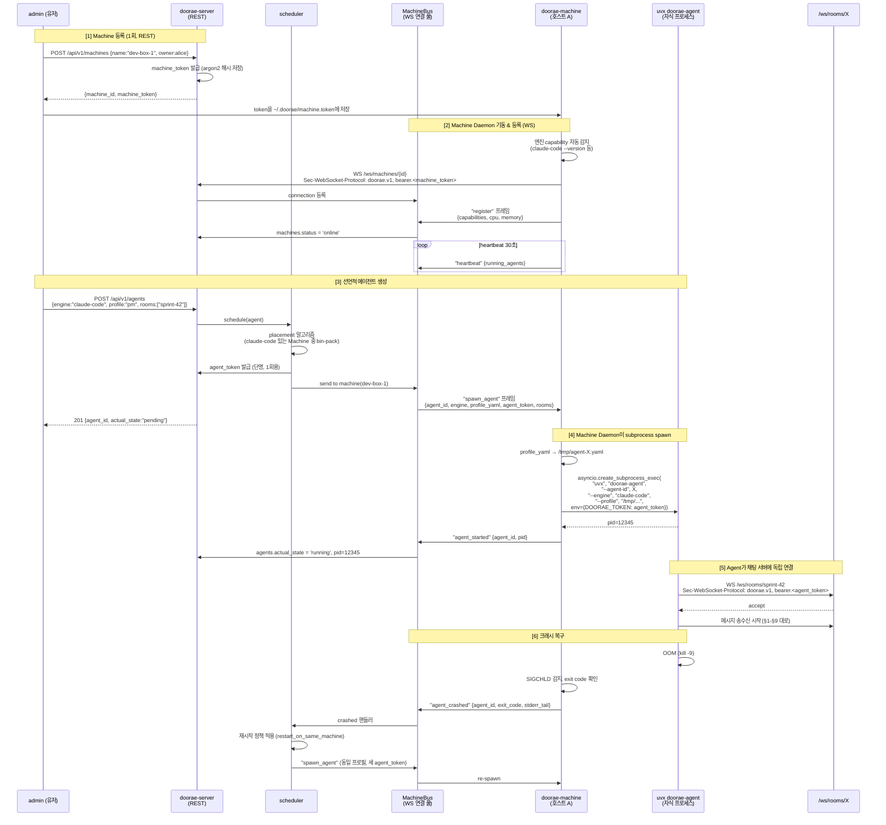

# 10 · Machine 스케줄링 계층

> Machine은 1급 스케줄링 리소스다. `doorae-machine` 데몬이 각 호스트에서 에이전트 subprocess를 관리하며, 서버 스케줄러가 "이 엔진으로 저 에이전트 띄워라"를 선언적으로 명령한다. 이 계층은 §1-§9의 경량 원칙 위에 **추가되는** 계층이지, 대체하지 않는다.

## 10.0 요약

**한 줄**: "Machine은 1급 스케줄링 리소스이며, `doorae-machine` Daemon을 통해 서버가 에이전트를 선언적으로 생성/종료한다."

### 왜 이 계층이 필요한가

원래 요구사항("프로젝트·머신·에이전트·유저" 4대 엔티티)에서 Machine은 "호스트당 복수 에이전트를 생성하는 활성 참여자"였다. 그러나 §1-§9의 초기 설계는 Machine을 **DB 테이블에만 존재하는 수동 메타데이터**로 다뤘고, 사용자가 매번 `uvx doorae-agent`를 수동 실행하는 것을 전제로 했다. 이것은 다음과 같은 운영 요구를 충족하지 못한다:

- "알리스는 자기 노트북에 PM과 Designer를, 밥은 GPU 머신에 Coder와 Analyst를" 같은 분산 배치
- 웹 UI에서 "PM 에이전트 1개 추가" 버튼으로 선언적 생성
- Agent 크래시 시 자동 재시작
- 머신 오프라인 시 에이전트 재배치
- 엔진 설치 상태를 서버가 아는 상태 (어느 머신에 claude-code가 있고 어느 머신에 openhands가 있는지)

이 계층은 이 모든 요구를 충족한다. 동시에 경량 원칙은 깨지지 않는다 — 서버 본체는 여전히 얇고, Daemon은 별도 프로세스이며, 스케줄링은 bin-pack 수준의 단순 알고리즘이다.

### 3개 구성 요소

| 구성 요소 | 설명 | LOC 추정 |
|---|---|---|
| **Machine Daemon** (`doorae-machine`) | 각 호스트에 상주. 엔진 자동 감지, 서버 WS 연결, subprocess spawn/kill 관리 | ~410 (별도 패키지, §10.3) |
| **서버 스케줄러** (`doorae/scheduler/` + `ws/` + `api/v1/`) | 에이전트 배치 결정, 생명주기 상태 머신, 활성 Machine 연결 풀 관리, REST/WS 엔드포인트 | ~440 (§10.7) |
| **인증·마이그레이션 확장** | `auth/machine_token.py`, Alembic 2종, Machine/Agent 컬럼 추가 | ~190 (§10.13) |

서버 본체(`doorae-server/`) 기준 **Machine 계층 소계 ~1,040**. 기존 §1-§9 기본 ~710 + 이 계층 ~1,040 = **~1,750**. Plan A의 "900-1,100 LOC" 범위를 넘지만 §10.13 예산표 상한 범위 내다. 정확한 세부 내역은 §10.13 체크리스트를 정본으로 참조한다.

### 기존 원칙 유지

이 계층은 §1-§9의 5대 원칙을 **모두 그대로** 유지한다:

1. **서버는 경량 메시징 허브** — 스케줄러는 경량 리소스 배치만 담당. LLM 호출, 도구 실행은 여전히 에이전트 엔진 몫.
2. **에이전트 두뇌는 엔진에** — 스케줄러는 "Claude Code 프로세스를 spawn하라"까지만. 그 안에서 일어나는 일은 관여 안 함.
3. **채팅은 네이티브 WebSocket** — Agent는 여전히 `/ws/rooms/{id}`로 서버와 직접 통신. Machine Daemon은 별도 엔드포인트 `/ws/machines/{id}`를 사용할 뿐.
4. **MCP는 외부 도구 영역** — Machine Daemon은 MCP를 전혀 모른다. 에이전트 엔진이 자체적으로 쓴다.
5. **서브에이전트 = 채널 기반** — `Room.parent_room_id + is_dm` 모델 그대로.

### Standalone 모드 (폴백)

Machine Daemon이 **강제**는 아니다. §1-§9의 기존 흐름(`uvx doorae-agent`로 에이전트 직접 기동)도 그대로 지원한다. 두 모드가 공존한다:

| 모드 | 사용 시점 | 동작 |
|---|---|---|
| **Scheduled 모드** (주력) | 프로덕션, 다중 머신, 선언적 운영 | `doorae-machine` 상주 → 서버가 명령 → Daemon이 spawn |
| **Standalone 모드** (폴백) | 로컬 테스트, 단발 데모, 1인 사용 | 사용자가 직접 `uvx doorae-agent` 실행. Machine 엔티티 무관 |

Standalone 모드에서 생성된 에이전트는 DB에 `placed_on_machine_id=NULL`로 기록된다. 서버 스케줄러는 이들을 관리하지 않으며, 수동 기동이 주체의 책임이다.

---

## 10.1 전체 흐름

Machine 등록부터 에이전트 spawn까지의 완전한 시퀀스:



핵심 포인트:

1. **두 개의 WebSocket 경로**가 존재한다: `/ws/machines/{id}` (Daemon ↔ 서버 제어) 와 `/ws/rooms/{id}` (Agent ↔ 서버 채팅). Daemon은 자기 자신이 채팅 WebSocket을 여는 역할이 아니다 — 그건 spawn된 자식 프로세스의 몫이다.
2. **토큰 3종이 구분**되어 발급된다: Machine Token(Daemon 전용) / Agent Token(자식 프로세스 전용, 단명) / User Token(API 호출용). 단, Daemon은 spawn 시점에 agent_token을 평문으로 **본다** (이는 고의적이며, 피할 수 없다 — §10.12 참조).
3. **자식 프로세스에 토큰은 환경변수로만** 전달한다. `--token <xxx>` 같은 CLI 인자는 `ps aux`에 노출되므로 금지. 이것은 **다른 로컬 유저**로부터 토큰을 보호하는 것이지, Daemon 자체의 침해로부터 보호하는 것이 아니다.
4. **Machine Daemon은 자기가 spawn한 Agent에 대한 신뢰 경계**다. Daemon이 compromise되면 해당 Machine에서 돌아가는 Agent들의 채팅 트래픽이 노출된다 (§10.12.4). 이는 Kubernetes에서 node가 compromise되면 그 node의 Pod들이 노출되는 것과 같은 구조다. Daemon을 신뢰할 수 있는 호스트에만 배치하고, 민감한 Room에 참여하는 Agent는 신뢰도 높은 Machine에 선택 배치한다.

---

## 10.2 데이터 모델 확장

### 10.2.1 `machines` 테이블 확장

```sql
-- 기존 machines 테이블에 컬럼 추가
ALTER TABLE machines ADD COLUMN owner_user_id UUID REFERENCES users(id);
ALTER TABLE machines ADD COLUMN status VARCHAR(20) DEFAULT 'offline'
    CHECK (status IN ('offline', 'online', 'draining', 'unreachable'));
ALTER TABLE machines ADD COLUMN daemon_last_seen_at TIMESTAMPTZ;
ALTER TABLE machines ADD COLUMN daemon_version VARCHAR(32);
ALTER TABLE machines ADD COLUMN cpu_cores INTEGER;
ALTER TABLE machines ADD COLUMN memory_gb INTEGER;
ALTER TABLE machines ADD COLUMN max_agents INTEGER DEFAULT 10;
ALTER TABLE machines ADD COLUMN labels JSONB DEFAULT '{}'::jsonb;
    -- 임의 태그: {"zone":"office","gpu":"a100","owner_team":"research"}
CREATE INDEX ix_machines_status_owner ON machines(status, owner_user_id);
CREATE INDEX ix_machines_labels ON machines USING GIN(labels);
```

| 필드 | 설명 |
|---|---|
| `owner_user_id` | 이 머신을 등록한 유저. 관리 권한은 owner + admin |
| `status` | `offline` / `online` / `draining` (더는 spawn 받지 않음) / `unreachable` (heartbeat 타임아웃) |
| `daemon_last_seen_at` | 마지막 heartbeat 타임스탬프 |
| `daemon_version` | Daemon 버전 문자열 (호환성 체크용) |
| `cpu_cores`, `memory_gb` | Daemon이 register 시 보고한 리소스 |
| `max_agents` | 이 머신에서 동시 실행 가능한 최대 에이전트 수 (기본 10) |
| `labels` | 스케줄러가 affinity 힌트에 사용하는 임의 key-value |

### 10.2.2 `machine_engines` 테이블 (신규)

```sql
CREATE TABLE machine_engines (
    machine_id UUID NOT NULL REFERENCES machines(id) ON DELETE CASCADE,
    engine VARCHAR(32) NOT NULL
        CHECK (engine IN (
            'claude-code', 'codex', 'openhands', 'deep-agents',
            'openai', 'anthropic'
        )),
    version VARCHAR(64),
    verified_at TIMESTAMPTZ DEFAULT now(),
    PRIMARY KEY (machine_id, engine)
);
CREATE INDEX ix_machine_engines_engine ON machine_engines(engine);
```

Daemon이 `register` 프레임을 보낼 때 함께 보고한 capability를 저장한다. 스케줄러는 이 테이블을 조회하여 "claude-code가 있는 Machine"을 필터링한다.

### 10.2.3 `machine_tokens` 테이블 (신규)

```sql
CREATE TABLE machine_tokens (
    id UUID PRIMARY KEY DEFAULT gen_random_uuid(),
    machine_id UUID NOT NULL REFERENCES machines(id) ON DELETE CASCADE,
    token_hash TEXT NOT NULL,           -- argon2
    lookup_hint VARCHAR(8) NOT NULL,    -- 토큰 앞 8자 (index용)
    created_at TIMESTAMPTZ DEFAULT now(),
    last_used_at TIMESTAMPTZ,
    expires_at TIMESTAMPTZ,             -- NULL = never, 권장: 회전
    revoked_at TIMESTAMPTZ
);
CREATE INDEX ix_machine_tokens_hint ON machine_tokens(lookup_hint)
    WHERE revoked_at IS NULL;
```

Machine Token은 **Agent Token과 완전 분리된 카테고리**다. 같은 `argon2` 해시 기법을 쓰지만 테이블과 검증 경로가 다르다. 상세는 §10.12 보안 참조.

### 10.2.4 `agents` 테이블 확장

```sql
-- 기존 agents 테이블에 스케줄링 필드 추가
ALTER TABLE agents ADD COLUMN engine VARCHAR(32)
    CHECK (engine IN (
        'claude-code', 'codex', 'openhands', 'deep-agents',
        'openai', 'anthropic'
    ));
ALTER TABLE agents ADD COLUMN placed_on_machine_id UUID REFERENCES machines(id);
ALTER TABLE agents ADD COLUMN desired_state VARCHAR(20) DEFAULT 'pending'
    CHECK (desired_state IN ('pending', 'running', 'stopped'));
ALTER TABLE agents ADD COLUMN actual_state VARCHAR(20) DEFAULT 'pending'
    CHECK (actual_state IN (
        'pending', 'starting', 'running', 'stopping', 'stopped', 'crashed'
    ));
ALTER TABLE agents ADD COLUMN pid INTEGER;
ALTER TABLE agents ADD COLUMN profile_yaml TEXT;
ALTER TABLE agents ADD COLUMN started_at TIMESTAMPTZ;
ALTER TABLE agents ADD COLUMN last_heartbeat_at TIMESTAMPTZ;
ALTER TABLE agents ADD COLUMN last_crash_reason TEXT;
ALTER TABLE agents ADD COLUMN restart_policy VARCHAR(32) DEFAULT 'restart_on_same_machine'
    CHECK (restart_policy IN ('no_restart', 'restart_on_same_machine', 'reschedule'));
CREATE INDEX ix_agents_placed_state
    ON agents(placed_on_machine_id, actual_state)
    WHERE actual_state IN ('running', 'starting');
```

| 필드 | 설명 |
|---|---|
| `engine` | 이 에이전트가 어떤 엔진을 사용하는가 (스케줄러의 필터 키) |
| `placed_on_machine_id` | 스케줄러가 선택한 Machine. `NULL`이면 아직 배치 안 됐거나 standalone 모드 |
| `desired_state` | 사용자가 원하는 상태 (pending/running/stopped) |
| `actual_state` | 실제 상태 (Daemon이 보고) |
| `pid` | Machine Daemon이 관리하는 자식 프로세스 PID |
| `profile_yaml` | 성향/시스템 프롬프트/Room 등 프로필 전체를 YAML 문자열로 저장 |
| `started_at` | `running`으로 처음 전환된 시각 |
| `last_heartbeat_at` | Agent 자체의 heartbeat (채팅 WS 연결 감시용) |
| `last_crash_reason` | 마지막 크래시의 이유 (exit code, stderr tail) |
| `restart_policy` | 크래시 시 복구 정책 |

**중요**: `actual_state`가 `running`인데 `last_heartbeat_at`이 5분 이상 전이면 **좀비**로 판정하여 서버가 `unknown`으로 마킹하고 다음 Daemon 연결 시 교정한다.

---

## 10.3 `doorae-machine` 패키지 구조

Machine Daemon은 서버 및 SDK와 **별도 저장소**다. 이유: Machine에 Daemon만 설치하면 되고 SDK나 서버 코드를 깔 필요가 없다.

```
doorae-machine/                 # 별도 PyPI 패키지 저장소
├── pyproject.toml              # name = "doorae-machine", packages = ["doorae_machine"]
├── README.md
├── LICENSE
├── doorae_machine/
│   ├── __init__.py             # __version__
│   ├── cli.py                  # doorae-machine CLI 엔트리
│   ├── daemon.py               # 메인 WS 루프 + 명령 처리
│   ├── detector.py             # 엔진 capability 자동 감지
│   ├── spawner.py              # asyncio.subprocess 관리
│   ├── supervisor.py           # 자식 프로세스 watchdog
│   ├── config.py               # ~/.doorae/machine.toml + ~/.doorae/machine.token
│   └── protocol/
│       ├── __init__.py
│       └── frames.py           # Machine↔Server 프레임 Pydantic 모델
└── tests/
    ├── test_detector.py
    ├── test_spawner.py
    └── test_daemon.py
```

**pyproject.toml**:

```toml
[build-system]
requires = ["hatchling"]
build-backend = "hatchling.build"

[project]
name = "doorae-machine"
version = "0.1.0"
description = "Doorae machine daemon — spawns agent subprocesses on a host"
requires-python = ">=3.11"

dependencies = [
    "websockets>=12.0,<14.0",
    "httpx>=0.27",               # register/login REST 호출 (cli.py, §10.9.2)
    "pydantic>=2.6",
    "pydantic-settings>=2.2",
    "click>=8.1",
    "structlog>=24.1",
    "psutil>=5.9",               # CPU/메모리 감지
    "pyyaml>=6.0",
    "argon2-cffi>=23.1",         # machine_token 로컬 저장 시 해시 (선택)
]

[project.optional-dependencies]
dev = ["pytest>=8.0", "pytest-asyncio>=0.23", "ruff>=0.3", "mypy>=1.9"]

[project.scripts]
doorae-machine = "doorae_machine.cli:main"

[tool.hatch.build.targets.wheel]
packages = ["doorae_machine"]
```

의존성은 **9개** — Daemon은 매우 가볍다.

LOC 예산:

| 모듈 | LOC |
|---|---|
| `cli.py` | ~80 (register/run/status 서브커맨드) |
| `daemon.py` | ~90 (WS 루프 + heartbeat) |
| `detector.py` | ~60 (엔진 감지) |
| `spawner.py` | ~80 (subprocess 관리) |
| `supervisor.py` | ~30 (watchdog) |
| `config.py` | ~30 |
| `protocol/frames.py` | ~40 (Pydantic 프레임 정의) |
| **합계** | **~410** |

---

## 10.4 엔진 감지 (`detector.py`)

각 엔진의 설치 여부와 버전을 자동 검사한다. Daemon이 `register` 시점에 1회 실행 + 설정 가능한 주기(예: 10분)로 재검증.

```python
# doorae_machine/detector.py
from __future__ import annotations
import asyncio
import os
import shutil
from typing import TypedDict


class EngineInfo(TypedDict):
    engine: str
    version: str | None
    path: str | None


# (engine_id, 검사 명령어)
_BINARY_ENGINES = [
    ("claude-code", ["claude-code", "--version"]),
    ("codex", ["codex", "--version"]),
    ("openhands", ["openhands", "--version"]),
]


async def _try_binary(engine: str, cmd: list[str]) -> EngineInfo | None:
    binary = shutil.which(cmd[0])
    if not binary:
        return None
    try:
        proc = await asyncio.create_subprocess_exec(
            *cmd,
            stdout=asyncio.subprocess.PIPE,
            stderr=asyncio.subprocess.PIPE,
        )
        out, _ = await asyncio.wait_for(proc.communicate(), timeout=5)
        if proc.returncode != 0:
            return None
        return {
            "engine": engine,
            "version": out.decode().strip().split("\n")[0],
            "path": binary,
        }
    except (asyncio.TimeoutError, FileNotFoundError):
        return None


async def _try_python_import(module: str, engine: str) -> EngineInfo | None:
    """Python 라이브러리는 import 테스트로 감지."""
    try:
        proc = await asyncio.create_subprocess_exec(
            "python",
            "-c",
            f"import {module}; print(getattr({module}, '__version__', '?'))",
            stdout=asyncio.subprocess.PIPE,
            stderr=asyncio.subprocess.PIPE,
        )
        out, _ = await asyncio.wait_for(proc.communicate(), timeout=5)
        if proc.returncode != 0:
            return None
        return {"engine": engine, "version": out.decode().strip(), "path": "python"}
    except Exception:
        return None


async def detect_engines() -> list[EngineInfo]:
    """호스트에서 사용 가능한 에이전트 엔진을 자동 감지한다.

    반환: EngineInfo 리스트. 감지된 엔진만 포함.
    """
    tasks = [_try_binary(e, c) for e, c in _BINARY_ENGINES]
    tasks.append(_try_python_import("deepagents", "deep-agents"))
    results = await asyncio.gather(*tasks)
    engines = [r for r in results if r is not None]

    # 환경변수 기반 엔진 (API 키만 있으면 동작)
    if os.getenv("OPENAI_API_KEY"):
        engines.append({"engine": "openai", "version": None, "path": None})
    if os.getenv("ANTHROPIC_API_KEY"):
        engines.append({"engine": "anthropic", "version": None, "path": None})

    return engines
```

감지 대상 엔진은 다음 6종:
- **binary**: `claude-code`, `codex`, `openhands`
- **python import**: `deep-agents` (deepagents 라이브러리)
- **env-based**: `openai`, `anthropic`

새 엔진 추가는 `_BINARY_ENGINES` 리스트에 한 줄 추가로 끝난다.

---

## 10.5 Daemon 메인 루프 (`daemon.py`)

```python
# doorae_machine/daemon.py
from __future__ import annotations
import asyncio
import json
import os

import psutil
import structlog
import websockets
from websockets.exceptions import ConnectionClosed

from .detector import detect_engines
from .spawner import AgentSpawner
from .protocol.frames import RegisterFrame, HeartbeatFrame

log = structlog.get_logger()


class MachineDaemon:
    """호스트당 하나의 상주 데몬.

    서버와 /ws/machines/{id} WebSocket을 유지하며, spawn/kill 명령을 받아
    로컬 agent subprocess를 관리한다.
    """

    def __init__(
        self,
        *,
        server_url: str,
        machine_id: str,
        machine_token: str,
        max_agents: int = 10,
    ):
        self.server_url = server_url.rstrip("/")
        self.machine_id = machine_id
        self.machine_token = machine_token
        self.max_agents = max_agents
        self.spawner = AgentSpawner(server_url=server_url)
        self.capabilities: list[dict] = []
        self._ws: websockets.WebSocketClientProtocol | None = None
        self._hb_task: asyncio.Task | None = None

    async def run(self) -> None:
        """주 진입점. 끊기면 지수 백오프 재연결."""
        self.capabilities = await detect_engines()
        log.info(
            "daemon_starting",
            machine_id=self.machine_id,
            engines=[e["engine"] for e in self.capabilities],
        )

        ws_url = (
            self.server_url.replace("http", "ws")
            + f"/ws/machines/{self.machine_id}"
        )
        retry = 0
        while True:
            try:
                async with websockets.connect(
                    ws_url,
                    # 토큰은 subprotocol 헤더로만 전달 (쿼리 파라미터 금지).
                    subprotocols=["doorae.v1", f"bearer.{self.machine_token}"],
                    ping_interval=20,
                    ping_timeout=10,
                    max_size=2**20,  # 1MB (프로필 YAML 포함 여유)
                ) as ws:
                    self._ws = ws
                    retry = 0
                    await self._register()
                    self._hb_task = asyncio.create_task(self._heartbeat_loop())
                    try:
                        async for raw in ws:
                            try:
                                msg = json.loads(raw)
                                await self._handle(msg)
                            except Exception as e:
                                log.error("handler_error", error=str(e))
                    finally:
                        if self._hb_task:
                            self._hb_task.cancel()
                        self._ws = None
            except ConnectionClosed:
                retry += 1
                wait = min(2**retry, 60)
                log.warning("daemon_disconnected", retry=retry, wait=wait)
                await asyncio.sleep(wait)
            except Exception as e:
                log.error("daemon_loop_error", error=str(e))
                await asyncio.sleep(10)

    async def _register(self) -> None:
        frame = RegisterFrame(
            type="register",
            daemon_version=self._daemon_version(),
            capabilities={
                "engines": self.capabilities,
                "cpu_cores": os.cpu_count() or 1,
                "memory_gb": psutil.virtual_memory().total // (1024**3),
                "max_agents": self.max_agents,
            },
        )
        assert self._ws is not None
        await self._ws.send(frame.model_dump_json())
        log.info("daemon_registered")

    async def _heartbeat_loop(self) -> None:
        """30초마다 heartbeat. 연결이 끊기면 바깥 루프가 재연결."""
        while True:
            await asyncio.sleep(30)
            if self._ws is None:
                return
            try:
                hb = HeartbeatFrame(
                    type="heartbeat",
                    running_agents=self.spawner.list_running(),
                )
                await self._ws.send(hb.model_dump_json())
            except ConnectionClosed:
                return
            except Exception as e:
                log.error("heartbeat_error", error=str(e))

    async def _handle(self, msg: dict) -> None:
        t = msg.get("type")
        if t == "spawn_agent":
            result = await self.spawner.spawn(msg)
            if self._ws:
                await self._ws.send(json.dumps(result))
        elif t == "kill_agent":
            result = await self.spawner.kill(msg["agent_id"])
            if self._ws:
                await self._ws.send(json.dumps(result))
        elif t == "drain":
            self.spawner.draining = True
            log.info("daemon_draining")
        elif t == "ping":
            if self._ws:
                await self._ws.send(json.dumps({"type": "pong"}))
        else:
            log.warning("unknown_frame_type", type=t)

    def _daemon_version(self) -> str:
        from . import __version__
        return __version__
```

핵심:
- WebSocket 인증은 **반드시 subprotocol 헤더**로 (쿼리 파라미터 금지, §5.7.1 참조).
- 재연결은 지수 백오프 (최대 60초).
- Heartbeat 30초 주기 — 서버 측에서 60초 이상 수신 안 되면 `unreachable`로 판정.
- 프레임은 Pydantic 모델(`frames.py`)로 타입 안전하게 직렬화.

---

## 10.6 Agent Spawner (`spawner.py`)

자식 프로세스 관리. 핵심 책임:
- `uvx doorae-agent`로 에이전트 subprocess 실행
- 프로필 YAML을 임시 파일에 저장 (커맨드라인에 내용을 넣지 않음)
- 토큰은 **환경변수**로만 전달 (`argv` 금지)
- 종료 감지 → 서버에 `agent_crashed` 보고

```python
# doorae_machine/spawner.py
from __future__ import annotations
import asyncio
import os
import tempfile
from pathlib import Path
from typing import TypedDict

import structlog
import yaml

log = structlog.get_logger()


class SpawnResult(TypedDict):
    type: str                    # "agent_started" | "agent_spawn_failed"
    agent_id: str
    pid: int | None
    error: str | None


class RunningAgent(TypedDict):
    agent_id: str
    engine: str
    pid: int
    profile_path: str


class AgentSpawner:
    def __init__(self, server_url: str):
        self.server_url = server_url
        self._processes: dict[str, asyncio.subprocess.Process] = {}
        self._meta: dict[str, RunningAgent] = {}
        self.draining = False

    def list_running(self) -> list[dict]:
        """heartbeat에 포함되는 running agent 목록."""
        return [
            {"agent_id": a, "engine": m["engine"], "pid": m["pid"]}
            for a, m in self._meta.items()
        ]

    async def spawn(self, msg: dict) -> SpawnResult:
        agent_id = msg["agent_id"]
        engine = msg["engine"]
        profile = msg["profile"]              # dict
        agent_token = msg["agent_token"]      # 서버가 발급한 단명 토큰
        rooms = msg.get("rooms", [])

        if self.draining:
            return {
                "type": "agent_spawn_failed",
                "agent_id": agent_id,
                "pid": None,
                "error": "machine is draining",
            }

        # 프로필을 임시 파일에 저장 (argv에 내용 넣지 않음)
        profile_path = (
            Path(tempfile.gettempdir()) / f"doorae-agent-{agent_id}.yaml"
        )
        profile_path.write_text(yaml.dump(profile, allow_unicode=True))
        os.chmod(profile_path, 0o600)  # 소유자만 읽기

        # subprocess 기동
        try:
            # 토큰은 환경변수로만. argv에 절대 넣지 않는다.
            env = {
                **os.environ,
                "DOORAE_TOKEN": agent_token,
                "DOORAE_AGENT_ID": agent_id,
            }
            args = [
                "uvx",
                "--from", f"doorae-sdk[{engine}]",
                "doorae-agent",
                "--agent-id", agent_id,
                "--engine", engine,
                "--profile", str(profile_path),
                "--server", self.server_url,
            ]
            for r in rooms:
                args.extend(["--room", r])

            proc = await asyncio.create_subprocess_exec(
                *args,
                env=env,
                stdout=asyncio.subprocess.PIPE,
                stderr=asyncio.subprocess.PIPE,
            )
            self._processes[agent_id] = proc
            self._meta[agent_id] = RunningAgent(
                agent_id=agent_id,
                engine=engine,
                pid=proc.pid,
                profile_path=str(profile_path),
            )

            # 백그라운드에서 프로세스 종료 감시
            asyncio.create_task(self._watch(agent_id, proc))

            log.info("agent_spawned", agent_id=agent_id, engine=engine, pid=proc.pid)
            return {
                "type": "agent_started",
                "agent_id": agent_id,
                "pid": proc.pid,
                "error": None,
            }
        except Exception as e:
            log.error("agent_spawn_failed", agent_id=agent_id, error=str(e))
            profile_path.unlink(missing_ok=True)
            return {
                "type": "agent_spawn_failed",
                "agent_id": agent_id,
                "pid": None,
                "error": str(e),
            }

    async def kill(self, agent_id: str) -> dict:
        proc = self._processes.get(agent_id)
        if not proc:
            return {"type": "agent_not_found", "agent_id": agent_id}
        proc.terminate()
        try:
            await asyncio.wait_for(proc.wait(), timeout=10)
        except asyncio.TimeoutError:
            proc.kill()
            await proc.wait()
        self._cleanup(agent_id)
        return {"type": "agent_stopped", "agent_id": agent_id, "reason": "kill_command"}

    async def _watch(self, agent_id: str, proc: asyncio.subprocess.Process) -> None:
        """자식 프로세스 종료 감시."""
        rc = await proc.wait()
        meta = self._meta.get(agent_id)
        if meta is None:
            return  # 이미 cleanup됨
        self._cleanup(agent_id)

        if rc == 0:
            log.info("agent_exited_cleanly", agent_id=agent_id)
            # 정상 종료는 보통 kill 명령의 결과
        else:
            # 비정상 종료 → stderr 마지막 수집 후 서버에 보고
            stderr_tail = b""
            if proc.stderr:
                try:
                    stderr_tail = await proc.stderr.read(2048)
                except Exception:
                    pass
            log.warning(
                "agent_crashed",
                agent_id=agent_id,
                exit_code=rc,
                stderr_tail=stderr_tail.decode(errors="replace")[-500:],
            )
            # 바깥 daemon이 이 이벤트를 서버에 전달 — 실제 구현은
            # asyncio.Queue를 통해 daemon.run()으로 푸시하는 식으로 연결.

    def _cleanup(self, agent_id: str) -> None:
        self._processes.pop(agent_id, None)
        meta = self._meta.pop(agent_id, None)
        if meta:
            Path(meta["profile_path"]).unlink(missing_ok=True)
```

**핵심 보안 고려사항**:
- `DOORAE_TOKEN` 환경변수로만 전달 — `ps aux`에 안 보임
- 프로필 파일은 `chmod 600` — 같은 호스트의 다른 유저가 못 읽음
- Agent 프로세스 종료 시 프로필 파일 자동 삭제 — 잔여물 없음

---

## 10.7 서버 스케줄러

서버 본체(`doorae-server`)에 추가되는 모듈:

```
doorae-server/doorae/
├── scheduler/                  # (신규)
│   ├── __init__.py
│   ├── placement.py            # Machine 선택 알고리즘
│   ├── lifecycle.py            # Agent 상태 머신
│   └── machine_bus.py          # 활성 Machine WS 연결 풀
├── ws/
│   ├── handler.py              # 기존 /ws/rooms/{id}
│   └── machine_handler.py      # (신규) /ws/machines/{id}
├── api/
│   └── v1/
│       ├── machines.py         # (신규) POST /api/v1/machines 등
│       └── agents.py           # (신규) POST /api/v1/agents (선언적 생성)
└── ...
```

LOC 예산:

| 모듈 | LOC |
|---|---|
| `scheduler/placement.py` | ~80 (bin-pack + affinity) |
| `scheduler/lifecycle.py` | ~100 (상태 머신 + 이벤트 핸들러) |
| `scheduler/machine_bus.py` | ~60 (활성 연결 풀, send_to_machine) |
| `ws/machine_handler.py` | ~120 (WS 핸들러 + register/heartbeat/spawn 처리) |
| `api/v1/machines.py` | ~40 (등록 REST) |
| `api/v1/agents.py` | ~40 (선언적 생성 REST) |
| **합계** | **~440** |

### 10.7.1 Placement 알고리즘 (`placement.py`)

```python
# doorae/scheduler/placement.py
from __future__ import annotations
from uuid import UUID
from sqlalchemy import func, select
from sqlalchemy.ext.asyncio import AsyncSession
from doorae.db.models import Agent, Machine, MachineEngine


class NoSuitableMachineError(Exception):
    """요청된 엔진을 가진 온라인 머신이 없거나 모두 꽉 찼을 때."""


async def select_machine_for(
    *,
    engine: str,
    db: AsyncSession,
    machine_bus: "MachineBus",
    required_labels: dict | None = None,
) -> Machine:
    """bin-pack 알고리즘으로 Machine을 선택한다.

    선정 기준:
      1. status='online'
      2. 해당 engine이 machine_engines에 등록됨
      3. 활성 WebSocket 연결이 machine_bus에 있음
      4. 현재 running agent 수가 max_agents 미만
      5. labels 요구사항 충족
    우선순위: 가장 적은 running agent를 가진 Machine 선택.
    """
    # 1-2: 온라인 + 엔진 매칭
    stmt = (
        select(Machine)
        .join(MachineEngine, MachineEngine.machine_id == Machine.id)
        .where(
            Machine.status == "online",
            MachineEngine.engine == engine,
        )
    )
    result = await db.execute(stmt)
    candidates = list(result.scalars().unique())

    # 3: 활성 연결
    candidates = [m for m in candidates if machine_bus.is_connected(m.id)]

    # 5: 라벨 필터
    if required_labels:
        candidates = [
            m for m in candidates
            if all(m.labels.get(k) == v for k, v in required_labels.items())
        ]

    if not candidates:
        raise NoSuitableMachineError(
            f"no online machine with engine={engine}, labels={required_labels}"
        )

    # 4: 용량 확인 + bin-pack
    counts = {}
    for m in candidates:
        count_stmt = (
            select(func.count())
            .select_from(Agent)
            .where(
                Agent.placed_on_machine_id == m.id,
                Agent.actual_state.in_(["running", "starting"]),
            )
        )
        running = (await db.execute(count_stmt)).scalar_one()
        if running < m.max_agents:
            counts[m.id] = (running, m)

    if not counts:
        raise NoSuitableMachineError(
            f"all matching machines are full (engine={engine})"
        )

    # bin-pack: 가장 적은 running을 가진 머신 선택
    _, chosen = min(counts.values(), key=lambda x: x[0])
    return chosen
```

알고리즘 특성:
- **O(N)** — N = 후보 Machine 수. 소규모(수십 대)에 적합.
- **결정론적이지 않음** — 동시에 같은 수의 agent를 가진 머신들 중에는 select 순서(= DB ORDER)에 의존. 필요 시 `ORDER BY id`를 추가하여 안정화 가능.
- **스케줄링 공평성** — 단순 bin-pack이므로 점유율이 높은 머신에 몰리지 않음.
- **미래 확장점** — 실제 CPU/메모리 사용률을 고려한 스코어링, anti-affinity(같은 역할 분산), NUMA/GPU 고려 등은 이 모듈에 단계적으로 추가.

### 10.7.2 Agent 생명주기 상태 머신 (`lifecycle.py`)

```
         POST /agents
              │
              ▼
          ┌────────┐
          │pending │  (스케줄러가 Machine 선택 중)
          └───┬────┘
              │ spawn_agent 전송
              ▼
          ┌────────┐
          │starting│  (Daemon이 subprocess 시작 중)
          └───┬────┘
              │ agent_started 수신
              ▼
          ┌────────┐     kill_agent       ┌────────┐
          │running │────────────────────▶│stopping│
          └───┬────┘                      └───┬────┘
              │                               │ agent_stopped
              │  agent_crashed                │ 수신
              ▼                               ▼
          ┌────────┐                      ┌────────┐
          │crashed │                      │stopped │
          └───┬────┘                      └────────┘
              │
              │ restart_policy에 따라
              │ restart_on_same_machine → starting
              │ reschedule → pending
              │ no_restart → 종료
              ▼
```

상태 머신 구현:

```python
# doorae/scheduler/lifecycle.py
from uuid import UUID
import structlog
from sqlalchemy import func
from sqlalchemy.ext.asyncio import AsyncSession

from doorae.db.models import Agent
from .placement import select_machine_for, NoSuitableMachineError

log = structlog.get_logger()


class AgentLifecycle:
    def __init__(self, db: AsyncSession, machine_bus: "MachineBus"):
        self.db = db
        self.machine_bus = machine_bus

    async def request_start(self, agent_id: UUID) -> None:
        """pending 상태 agent를 스케줄링하여 Machine에 spawn 명령."""
        agent = await self.db.get(Agent, agent_id)
        if agent is None or agent.desired_state != "running":
            return

        try:
            machine = await select_machine_for(
                engine=agent.engine,
                db=self.db,
                machine_bus=self.machine_bus,
            )
        except NoSuitableMachineError as e:
            log.error("scheduling_failed", agent_id=str(agent_id), error=str(e))
            agent.actual_state = "pending"
            agent.last_crash_reason = str(e)
            await self.db.commit()
            return

        # agent_token 단명 발급 (실제 AgentToken 레코드 저장은 §10.12.3 참조)
        from doorae.auth.token import generate_token
        agent_token = generate_token()

        agent.placed_on_machine_id = machine.id
        agent.actual_state = "starting"
        await self.db.commit()

        await self.machine_bus.send(
            machine.id,
            {
                "type": "spawn_agent",
                "agent_id": str(agent_id),
                "engine": agent.engine,
                "profile": _profile_dict(agent.profile_yaml),
                "agent_token": agent_token,
                "rooms": _room_ids_for(agent),
            },
        )

    async def on_agent_started(self, agent_id: UUID, pid: int) -> None:
        agent = await self.db.get(Agent, agent_id)
        agent.actual_state = "running"
        agent.pid = pid
        agent.started_at = func.now()
        await self.db.commit()

    async def on_agent_crashed(
        self, agent_id: UUID, exit_code: int, stderr_tail: str
    ) -> None:
        agent = await self.db.get(Agent, agent_id)
        agent.actual_state = "crashed"
        agent.last_crash_reason = f"exit_code={exit_code} tail={stderr_tail[-500:]}"
        await self.db.commit()

        # 재시작 정책
        if agent.restart_policy == "no_restart":
            return
        if agent.restart_policy == "restart_on_same_machine":
            agent.actual_state = "pending"
            await self.db.commit()
            await self.request_start(agent_id)
        elif agent.restart_policy == "reschedule":
            agent.placed_on_machine_id = None
            agent.actual_state = "pending"
            await self.db.commit()
            await self.request_start(agent_id)

    async def request_stop(self, agent_id: UUID) -> None:
        agent = await self.db.get(Agent, agent_id)
        if agent.placed_on_machine_id is None:
            agent.actual_state = "stopped"
            agent.desired_state = "stopped"
            await self.db.commit()
            return

        agent.desired_state = "stopped"
        agent.actual_state = "stopping"
        await self.db.commit()

        await self.machine_bus.send(
            agent.placed_on_machine_id,
            {"type": "kill_agent", "agent_id": str(agent_id)},
        )
```

### 10.7.3 MachineBus (`machine_bus.py`)

활성 Machine WebSocket 연결 풀. 메모리 기반 (단일 서버 프로세스 가정).

```python
# doorae/scheduler/machine_bus.py
from __future__ import annotations
import asyncio
import json
from uuid import UUID
import structlog
from fastapi import WebSocket

log = structlog.get_logger()


class MachineBus:
    """활성 Machine WebSocket 연결 풀.

    여러 서버 인스턴스를 띄울 경우 이 클래스를 Redis Pub/Sub 등으로 분산
    해야 한다 — 하지만 경량 철학상 기본은 단일 프로세스 인-메모리다.
    """

    def __init__(self):
        self._conns: dict[UUID, WebSocket] = {}
        self._lock = asyncio.Lock()

    async def register(self, machine_id: UUID, ws: WebSocket) -> None:
        async with self._lock:
            existing = self._conns.get(machine_id)
            if existing is not None:
                try:
                    await existing.close(code=1008, reason="duplicate registration")
                except Exception:
                    pass
            self._conns[machine_id] = ws
            log.info("machine_bus_registered", machine_id=str(machine_id))

    async def unregister(self, machine_id: UUID) -> None:
        async with self._lock:
            self._conns.pop(machine_id, None)
            log.info("machine_bus_unregistered", machine_id=str(machine_id))

    def is_connected(self, machine_id: UUID) -> bool:
        return machine_id in self._conns

    async def send(self, machine_id: UUID, frame: dict) -> bool:
        ws = self._conns.get(machine_id)
        if ws is None:
            log.error("machine_not_connected", machine_id=str(machine_id))
            return False
        try:
            await ws.send_text(json.dumps(frame))
            return True
        except Exception as e:
            log.error("send_failed", machine_id=str(machine_id), error=str(e))
            return False

    def all_online(self) -> list[UUID]:
        return list(self._conns.keys())
```

---

## 10.8 WebSocket 프로토콜 (`/ws/machines/{id}`)

Machine Daemon ↔ 서버 사이의 모든 상호작용. 인증은 `Sec-WebSocket-Protocol: doorae.v1, bearer.<machine_token>`.

### 10.8.1 프레임 타입 표

| 방향 | `type` | 용도 |
|---|---|---|
| C→S | `register` | 접속 직후 1회. capabilities 포함 |
| C→S | `heartbeat` | 30초 주기. running_agents 목록 포함 |
| C→S | `agent_started` | spawn 성공, pid 포함 |
| C→S | `agent_spawn_failed` | spawn 실패, error 포함 |
| C→S | `agent_stopped` | 정상 종료 (kill 또는 self-exit 0) |
| C→S | `agent_crashed` | 비정상 종료, exit_code + stderr_tail |
| C→S | `pong` | server의 `ping` 응답 |
| S→C | `spawn_agent` | 에이전트 생성 명령, agent_token 포함 |
| S→C | `kill_agent` | 에이전트 종료 명령 |
| S→C | `drain` | 이 머신을 드레인 모드로 전환 |
| S→C | `ping` | WS keepalive (websockets 라이브러리 기본 ping 외에 애플리케이션 레벨 확인용) |

### 10.8.2 프레임 JSON 스키마 예시

**`register` (C→S)**:

```json
{
  "type": "register",
  "daemon_version": "0.1.0",
  "capabilities": {
    "engines": [
      {"engine": "claude-code", "version": "0.6.1", "path": "/usr/local/bin/claude-code"},
      {"engine": "codex", "version": "0.50.3", "path": "/usr/local/bin/codex"},
      {"engine": "openai", "version": null, "path": null}
    ],
    "cpu_cores": 8,
    "memory_gb": 16,
    "max_agents": 10
  }
}
```

**`heartbeat` (C→S)**:

```json
{
  "type": "heartbeat",
  "running_agents": [
    {"agent_id": "01HX...", "engine": "claude-code", "pid": 12345},
    {"agent_id": "01HY...", "engine": "codex", "pid": 12346}
  ]
}
```

**`spawn_agent` (S→C)**:

```json
{
  "type": "spawn_agent",
  "agent_id": "01HZ...",
  "engine": "claude-code",
  "agent_token": "agt_01HZABCDEF...",
  "profile": {
    "name": "PM",
    "role": "project_manager",
    "system_prompt": "당신은 Doorae 프로젝트의 PM입니다...",
    "llm": {"model": "claude-sonnet-4-5", "temperature": 0.7},
    "mcp_servers": [...]
  },
  "rooms": ["room_sprint42_id"]
}
```

**`agent_started` (C→S)**:

```json
{
  "type": "agent_started",
  "agent_id": "01HZ...",
  "pid": 12347
}
```

**`agent_crashed` (C→S)**:

```json
{
  "type": "agent_crashed",
  "agent_id": "01HZ...",
  "exit_code": 137,
  "stderr_tail": "MemoryError: ...",
  "crashed_at": "2026-04-08T22:15:32.123Z"
}
```

**`kill_agent` (S→C)** / **`drain` (S→C)**: 각각 `{"type": "kill_agent", "agent_id": "..."}`, `{"type": "drain"}`.

### 10.8.3 서버 측 WebSocket 핸들러

```python
# doorae/ws/machine_handler.py
from __future__ import annotations
import json
from uuid import UUID

from fastapi import APIRouter, Depends, WebSocket
import structlog

from doorae.auth.dependencies import get_machine_identity
from doorae.db.engine import get_db
from doorae.db.models import Machine, MachineEngine
from doorae.scheduler.lifecycle import AgentLifecycle
from doorae.scheduler.machine_bus import MachineBus

log = structlog.get_logger()
router = APIRouter()


@router.websocket("/ws/machines/{machine_id}")
async def machine_ws(
    websocket: WebSocket,
    machine_id: UUID,
    identity=Depends(get_machine_identity),     # Machine Token 검증
    db=Depends(get_db),
    bus: MachineBus = Depends(lambda: ...),      # DI
    lifecycle: AgentLifecycle = Depends(lambda: ...),
):
    # 1) 토큰 owner가 이 machine_id의 소유자인지 확인
    if identity.machine_id != machine_id:
        await websocket.close(code=1008, reason="token/machine mismatch")
        return

    # 2) subprotocol 수락
    await websocket.accept(subprotocol="doorae.v1")
    await bus.register(machine_id, websocket)

    # 3) Machine 상태를 online으로
    machine = await db.get(Machine, machine_id)
    machine.status = "online"
    await db.commit()

    try:
        async for raw in websocket.iter_text():
            try:
                msg = json.loads(raw)
            except ValueError:
                continue
            await _handle_frame(msg, machine, db, lifecycle)
    except Exception as e:
        log.error("machine_ws_error", machine_id=str(machine_id), error=str(e))
    finally:
        # 4) 연결 끊김 처리
        await bus.unregister(machine_id)
        machine = await db.get(Machine, machine_id)
        machine.status = "offline"
        await db.commit()
        log.info("machine_disconnected", machine_id=str(machine_id))


async def _handle_frame(msg, machine, db, lifecycle: AgentLifecycle):
    t = msg.get("type")
    if t == "register":
        # capabilities를 DB에 반영
        caps = msg["capabilities"]
        machine.cpu_cores = caps.get("cpu_cores")
        machine.memory_gb = caps.get("memory_gb")
        machine.max_agents = caps.get("max_agents", 10)
        machine.daemon_version = msg.get("daemon_version")

        # machine_engines 테이블 upsert
        await db.execute(
            "DELETE FROM machine_engines WHERE machine_id = :mid",
            {"mid": machine.id},
        )
        for e in caps.get("engines", []):
            db.add(MachineEngine(
                machine_id=machine.id,
                engine=e["engine"],
                version=e.get("version"),
            ))
        await db.commit()

    elif t == "heartbeat":
        from datetime import datetime, UTC
        machine.daemon_last_seen_at = datetime.now(UTC)
        await db.commit()

    elif t == "agent_started":
        await lifecycle.on_agent_started(UUID(msg["agent_id"]), msg["pid"])

    elif t == "agent_spawn_failed":
        # pending 상태로 되돌리기 + 에러 기록
        ...

    elif t == "agent_stopped":
        from doorae.db.models import Agent
        agent = await db.get(Agent, UUID(msg["agent_id"]))
        agent.actual_state = "stopped"
        await db.commit()

    elif t == "agent_crashed":
        await lifecycle.on_agent_crashed(
            UUID(msg["agent_id"]),
            msg.get("exit_code", -1),
            msg.get("stderr_tail", ""),
        )
```

---

## 10.9 CLI — `doorae-machine`

### 10.9.1 명령어 목록

```
doorae-machine [command] [options]

Commands:
  register                    서버에 이 머신을 등록하고 토큰을 받는다
  run                         데몬 실행 (systemd와 함께 사용)
  status                      현재 상태 출력
  install-systemd-unit        ~/.config/systemd/user/ 에 유닛 파일 생성
  version                     버전 출력
```

### 10.9.2 `register` 상세

```bash
$ doorae-machine register \
    --server https://doorae.example.com \
    --name dev-box-1

? Owner email: alice@example.com
? Owner password: ********

Detecting engines on this host...
  ✓ claude-code 0.6.1 (/usr/local/bin/claude-code)
  ✓ codex 0.50.3 (/usr/local/bin/codex)
  ✗ openhands (not found on PATH)
  ✗ deep-agents (not importable in default python)
  ✓ openai (OPENAI_API_KEY detected in environment)
  ✓ anthropic (ANTHROPIC_API_KEY detected in environment)

Registering machine...
  ✓ Machine 'dev-box-1' registered (id=mac_01HXABCDEF...)
  ✓ Token saved to: /home/alice/.doorae/machine.token (chmod 600)

Next steps:
  # Foreground 실행:
  $ doorae-machine run

  # 또는 systemd user unit 설치 후 상시 실행:
  $ doorae-machine install-systemd-unit
  $ systemctl --user enable --now doorae-machine
  $ loginctl enable-linger $USER
```

### 10.9.3 `run` 상세

```bash
$ doorae-machine run
[INFO] Loading config from /home/alice/.doorae/machine.toml
[INFO] Detecting engines...
[INFO]   - claude-code 0.6.1
[INFO]   - codex 0.50.3
[INFO]   - openai
[INFO]   - anthropic
[INFO] Connecting to wss://doorae.example.com/ws/machines/mac_01HXABCDEF...
[INFO] Connected. Waiting for spawn commands.
[INFO] heartbeat sent (0 running agents)
[INFO] received spawn_agent: agent_id=01HZ... engine=claude-code
[INFO] agent spawned: pid=12345
[INFO] heartbeat sent (1 running agents)
...
```

### 10.9.4 `status` 상세

```bash
$ doorae-machine status
Machine: dev-box-1 (mac_01HXABCDEF...)
Server:  wss://doorae.example.com
Status:  online (connected 2h 15m ago)

Engines:
  claude-code 0.6.1
  codex 0.50.3
  openai
  anthropic

Running agents: 3
  ┌──────────────┬──────────┬────────────┬─────────┬──────────┐
  │ agent_id     │ name     │ engine     │ pid     │ uptime   │
  ├──────────────┼──────────┼────────────┼─────────┼──────────┤
  │ 01HZ...      │ PM       │ claude-code│ 12345   │ 1h 30m   │
  │ 01HZ...      │ TechLead │ claude-code│ 12346   │ 45m      │
  │ 01HZ...      │ Coder    │ codex      │ 12347   │ 20m      │
  └──────────────┴──────────┴────────────┴─────────┴──────────┘
```

### 10.9.5 설정 파일 (`~/.doorae/machine.toml`)

```toml
# ~/.doorae/machine.toml (register 시 자동 생성)

[machine]
id = "mac_01HXABCDEF..."
name = "dev-box-1"
server_url = "wss://doorae.example.com"

[limits]
max_agents = 10
spawn_timeout_sec = 30
kill_grace_sec = 10

[reconnect]
max_backoff_sec = 60
```

토큰은 **별도 파일** `~/.doorae/machine.token`에 저장하며 `chmod 600`. 토큰을 TOML 안에 두지 않는 이유는 실수로 git에 올리는 사고를 줄이기 위함이다.

---

## 10.10 배포 — systemd user unit

```ini
# ~/.config/systemd/user/doorae-machine.service
[Unit]
Description=Doorae Machine Daemon
After=network-online.target
Wants=network-online.target

[Service]
Type=simple
ExecStart=%h/.local/bin/uvx doorae-machine run
Restart=on-failure
RestartSec=10
MemoryMax=256M

# 로그
StandardOutput=append:%h/.doorae/logs/machine.log
StandardError=append:%h/.doorae/logs/machine-err.log

# 보안 하드닝
NoNewPrivileges=true
ProtectSystem=strict
ReadWritePaths=%h/.doorae /tmp
ProtectHome=false

[Install]
WantedBy=default.target
```

활성화:

```bash
$ doorae-machine install-systemd-unit
Installed: /home/alice/.config/systemd/user/doorae-machine.service

$ systemctl --user daemon-reload
$ systemctl --user enable --now doorae-machine
$ loginctl enable-linger alice       # 로그아웃 후에도 유지

$ systemctl --user status doorae-machine
● doorae-machine.service - Doorae Machine Daemon
   Loaded: loaded (~/.config/systemd/user/doorae-machine.service; enabled)
   Active: active (running) since ...
   Memory: 52.3M (max: 256.0M)
```

**Docker 필요 없음, root 권한 필요 없음**. 유저 단위 systemd만 사용.

---

## 10.11 실패 시나리오

### 10.11.1 Daemon 프로세스 크래시

| 시점 | 동작 |
|---|---|
| T+0s | Daemon 프로세스 종료 (OOM, panic 등) |
| T+0s | 서버 WS 연결 끊김 감지 → `MachineBus.unregister` → `machines.status='offline'` |
| T+0s | 이 Machine의 agent들은 **여전히 자신의 WS로 서버에 연결되어 있음** — 즉시 영향 없음 |
| T+10s | systemd `Restart=on-failure` + `RestartSec=10` → Daemon 재시작 |
| T+10s | Daemon이 엔진 재감지 + 서버 재연결 + `register` 재전송 |
| T+10s | 서버는 이 Machine의 기존 agent 목록과 Daemon의 `heartbeat.running_agents`를 대조. 일치하면 그대로, 불일치하면 정리 |
| T+11s | 정상 복귀 |

**핵심**: Agent subprocess는 Daemon과 독립적인 WS 연결을 가지므로, Daemon이 잠시 죽어도 **채팅은 중단되지 않는다**.

### 10.11.2 Machine 호스트 네트워크 단절

| 시점 | 동작 |
|---|---|
| T+0s | 네트워크 단절 |
| T+0s | Daemon의 WS 끊김 감지 → 재연결 루프 진입 (지수 백오프) |
| T+0s | Agent들의 WS도 끊김 → 각자 재연결 루프 |
| T+60s | 서버: Daemon heartbeat 60초 미수신 → `machines.status='unreachable'` |
| T+60s | 서버: 이 Machine의 agent들도 연결 끊긴 상태 → `last_heartbeat_at` 오래됨 |
| T+N | 네트워크 복구 → Daemon 재연결 → `register` → `machines.status='online'` |
| T+N | Agent들도 각자 재연결 → 정상 상태 복귀 |

**재배치 여부**: `unreachable` 상태에서 `reschedule` 정책을 가진 agent는 다른 Machine에 재배치될 수 있다. 이때 원래 Machine이 나중에 복귀하면 "같은 agent가 두 Machine에 있는" 분열 상태가 발생한다. 해결:
- `reschedule`은 기본이 아님
- 명시적으로 활성화 시에만 적용
- 재배치 전 타임아웃 (예: 5분)을 두어 네트워크 일시 단절로 성급히 재배치 안 함

### 10.11.3 Agent 자식 프로세스 크래시

| 시점 | 동작 |
|---|---|
| T+0s | Agent subprocess OOM → kernel이 SIGKILL |
| T+0s | Daemon의 `_watch` 태스크가 `proc.wait()`에서 exit_code=137 획득 |
| T+0s | Daemon이 `agent_crashed` 프레임 전송 (stderr tail 포함) |
| T+0s | 서버: `lifecycle.on_agent_crashed` → `actual_state='crashed'` |
| T+0s | 서버: `restart_policy`에 따라: |
|  | - `no_restart`: 종료 |
|  | - `restart_on_same_machine` (기본): 같은 Machine에 re-spawn |
|  | - `reschedule`: 다른 Machine으로 |
| T+1s | 재시작이면 새 agent_token 발급 + `spawn_agent` 전송 |
| T+2s | Daemon이 새 subprocess 기동 → `agent_started` |
| T+2s | 서버: `actual_state='running'`, 채팅 참여 재개 |

### 10.11.4 Zombie agent (Daemon이 모르는 상태)

| 증상 | 진단 | 복구 |
|---|---|---|
| DB에 `actual_state='running'`, Daemon heartbeat에 해당 agent 없음 | DB와 Daemon 상태 불일치 (Daemon 재시작 직후 가능) | 서버 주기 cleanup 태스크 (예: 1분마다)가 heartbeat 목록과 DB를 비교. 불일치 시 `actual_state='unknown'`으로 마킹. 다음 heartbeat에 등장하면 `running`으로 복귀. 3회 연속 누락이면 `crashed`로 전환 후 재시작 정책 적용. |

### 10.11.5 서버 재시작

| 시점 | 동작 |
|---|---|
| T+0s | 서버 uvicorn 재시작 |
| T+0s | 모든 Machine WS 연결 끊김. 모든 Agent WS 연결도 끊김 |
| T+1s | 서버 재기동 완료. 메모리 상태 초기화 (`MachineBus`, `ConnectionManager`) |
| T+2s | Daemon들이 재연결 + `register` |
| T+2s | Agent들도 재연결 + `?since_seq=N`으로 놓친 메시지 복구 |
| T+3s | Daemon의 `heartbeat.running_agents`와 DB의 `actual_state` 비교 |
|  | - DB는 `running`인데 heartbeat에 있음 → 유지 |
|  | - DB는 `running`인데 heartbeat에 없음 → `unknown` 마킹 |
|  | - heartbeat에 있는데 DB에 없음 → 고아 프로세스 (매우 드묾). Daemon에 `kill_agent` 전송 |

**핵심**: 서버는 stateless. 재시작 후 DB + Daemon register + Agent 재연결을 통해 전체 상태를 재구성할 수 있다.

### 10.11.6 Machine 수동 드레인 (유지보수)

```bash
# admin CLI (doorae-server 패키지 안)
$ doorae-client admin machine drain dev-box-1
Draining dev-box-1...
  ✓ "drain" command sent
  Current agents: 3 (will be rescheduled)
  Waiting for new agents to be rejected: ✓
  Migrating agents:
    - PM → rescheduling... → moved to gpu-box-2
    - TechLead → rescheduling... → moved to dev-box-3
    - Coder → rescheduling... → moved to gpu-box-2
  ✓ dev-box-1 is drained. Safe to shut down.
```

`drain` 상태에서:
- 새로운 `spawn_agent` 거부
- 기존 agent는 그대로 유지 (명시적 `kill_agent` 없이는 안 건드림)
- admin이 원하면 agent들을 다른 Machine에 재배치 (`reschedule` 정책을 일시 적용)

---

## 10.12 보안

### 10.12.1 토큰 3종 완전 분리

| 토큰 | 주체 | 저장 위치 | 스코프 | 유효기간 | 사용 경로 |
|---|---|---|---|---|---|
| **JWT** | User | 브라우저 localStorage / CLI 환경변수 | 계정 + 역할 | 24h | `Authorization: Bearer ...` 헤더 (HTTP), `Sec-WebSocket-Protocol` (WS) |
| **Agent Token** | Agent 인스턴스 | Agent 프로세스 환경변수 `DOORAE_TOKEN` | 특정 agent의 Room 참여 | 단명 (1회성, 프로세스 수명) | `/ws/rooms/{id}` |
| **Machine Token** | Machine Daemon | `~/.doorae/machine.token` (chmod 600) | 자기 Machine 제어 | 장명 (회전 권장) | `/ws/machines/{id}` |

**중요**: Machine Token은 채팅 메시지 송수신 권한이 **없다**. Agent Token은 Machine 제어 권한이 **없다**. User Token은 원칙적으로 양쪽 모두 가능하지만, 서비스 로직이 분리되어 실제로는 필요한 것만 인가한다.

### 10.12.2 Machine Token 발급 및 검증

**발급** (REST `POST /api/v1/machines`):

```python
# doorae/api/v1/machines.py
from secrets import token_urlsafe
from argon2 import PasswordHasher

@router.post("/machines", status_code=201)
async def register_machine(
    req: RegisterMachineRequest,
    owner: User = Depends(require_user),
    db: AsyncSession = Depends(get_db),
):
    machine = Machine(
        name=req.name,
        owner_user_id=owner.id,
        status="offline",
        labels=req.labels or {},
    )
    db.add(machine)
    await db.flush()  # machine.id 확정

    # Machine Token 발급
    raw = token_urlsafe(32)  # 256-bit
    ph = PasswordHasher()
    token_hash = ph.hash(raw)

    token_record = MachineToken(
        machine_id=machine.id,
        token_hash=token_hash,
        lookup_hint=raw[:8],
        expires_at=None,  # 기본 무기한 (운영자가 회전)
    )
    db.add(token_record)
    await db.commit()

    return {
        "machine_id": str(machine.id),
        "machine_token": raw,  # 평문은 지금만 반환됨, 다시 못 봄
    }
```

**검증** (`doorae/auth/machine_token.py`, 신규):

```python
from argon2 import PasswordHasher
from argon2.exceptions import VerifyMismatchError
from sqlalchemy import select
from datetime import datetime, UTC

ph = PasswordHasher()

async def verify_machine_token(
    raw_token: str, db: AsyncSession
) -> MachineToken | None:
    """WebSocket handshake에서 호출된다."""
    hint = raw_token[:8]
    result = await db.execute(
        select(MachineToken).where(
            MachineToken.lookup_hint == hint,
            MachineToken.revoked_at.is_(None),
        )
    )
    candidates = list(result.scalars())
    for tok in candidates:
        try:
            ph.verify(tok.token_hash, raw_token)
        except VerifyMismatchError:
            continue
        # 만료 체크
        if tok.expires_at and tok.expires_at < datetime.now(UTC):
            return None
        tok.last_used_at = datetime.now(UTC)
        await db.commit()
        return tok
    return None
```

`get_machine_identity` Dependency는 이 함수를 호출하여 `MachineIdentity` 객체를 반환하며, WebSocket handler는 `MachineIdentity.machine_id`가 URL의 `{machine_id}`와 일치하는지 확인한다.

### 10.12.3 Agent Token (단명 1회용)

스케줄러가 `spawn_agent` 프레임을 만들 때 발급. 프로세스가 종료되면 DB에서 삭제. 절대 `~/.doorae/`에 영구 저장하지 않는다.

```python
# scheduler/lifecycle.py 일부
agent_token = token_urlsafe(32)
agent_token_hash = ph.hash(agent_token)

# DB에 해시만 저장 (컬럼명은 05-security.md §5.2.2 정본: `hash`)
agent_token_record = AgentToken(
    agent_id=agent.id,
    hash=agent_token_hash,
    lookup_hint=agent_token[:8],
    expires_at=datetime.now(UTC) + timedelta(hours=24),  # 단명
)
db.add(agent_token_record)
await db.commit()

# spawn_agent 프레임의 "agent_token" 필드에 평문 포함 (Daemon → subprocess)
await machine_bus.send(machine.id, {
    "type": "spawn_agent",
    ...
    "agent_token": agent_token,
})
```

Daemon은 이 토큰을 **환경변수로만** subprocess에 전달 (argv 금지 — `ps eww`로 다른 로컬 유저가 읽는 것을 막는다). 그러나 **Daemon 자신은** 이 토큰을 평문으로 본다 — spawn 프레임에서 받아서 환경변수로 넘기기 때문이다. 이것은 피할 수 없는 구조적 사실이며, §10.12.4에서 보안적 의미를 명시적으로 다룬다.

### 10.12.4 Daemon은 자기가 spawn한 Agent의 신뢰 경계다

**중요한 정정 (2026-04-08)**: 초기 초안은 "Daemon compromise 시에도 채팅 메시지는 유출되지 않는다"고 주장했으나 **이는 잘못된 주장이다**. 스케줄러가 `spawn_agent` 프레임에 `agent_token`을 포함해서 Daemon에 전달하기 때문에, Daemon을 침해한 공격자는:

1. 진행 중이거나 앞으로 오는 `spawn_agent` 프레임을 가로채어 `agent_token`을 평문으로 읽는다
2. 그 토큰으로 `/ws/rooms/{id}`에 해당 Agent를 가장하여 직접 접속할 수 있다
3. Agent가 참여하는 모든 Room의 메시지를 읽고 쓸 수 있다

이것은 **구조적 신뢰 관계**다. Kubernetes에서 node가 compromise되면 그 node에서 돌아가는 Pod들의 service account token이 노출되어 공격자가 Pod로 가장할 수 있는 것과 **정확히 같은 종류**의 경계 침해다. 이 구현은 이 구조를 **의도적으로 선택**했다 — Agent가 자체 키 자료를 먼저 만들고 서버에 등록하는 복잡한 attestation 흐름을 도입하면 경량 원칙이 깨지기 때문이다.

따라서 **Machine Daemon은 자기가 spawn한 모든 Agent에 대해 신뢰 경계로 취급되어야 한다**. 구체적으로:

#### 10.12.4.1 공격자가 Daemon 침해로 얻는 것

| 역량 | 영향 |
|---|---|
| **`spawn_agent` 프레임 가로채기** | 진행 중 및 향후 spawn 모두의 `agent_token` 평문 획득 |
| **기존 subprocess의 환경변수 덤프** | 이미 돌고 있는 Agent들의 `DOORAE_TOKEN` 값 획득 (proc/[pid]/environ) |
| **Agent 가장 접속** | 획득한 토큰으로 `/ws/rooms/{id}`에 접속하여 해당 Agent의 모든 Room 트래픽을 읽고 쓰기 |
| **새 프로필로 악성 Agent spawn** | 서버에는 정상으로 보이는 Agent 생성 (서버 스케줄러가 이미 이 Machine을 신뢰한 상태) |
| **임의 subprocess 실행** | Daemon OS 유저 권한 내에서 아무 명령 실행 가능 (로컬 유저 권한 그대로) |
| **Machine Token 재사용** | 다른 호스트에서 Machine Token을 쓰면 서버가 이 Machine으로 착각. 하지만 네트워크 레이어에서 IP 이탈이 드러날 수 있음 (향후 개선) |

#### 10.12.4.2 공격자가 Daemon 침해로 얻지 못하는 것

| 한계 | 이유 |
|---|---|
| **다른 Machine의 Agent 트래픽** | 다른 Daemon에게 가는 `spawn_agent` 프레임은 보지 못함 |
| **User JWT** | User 경로는 별도. Daemon은 유저 세션에 관여하지 않음 |
| **이 Machine이 spawn하지 않은 Agent의 토큰** | Standalone 모드로 직접 기동된 Agent, 또는 다른 Machine에서 spawn된 Agent의 토큰은 Daemon이 본 적 없음 |
| **이미 만료된 Agent의 토큰** | 단명 Agent Token은 expire 후 서버가 거부 |
| **서버 관리자 권한** | Machine Token은 admin 권한이 아님. `POST /machines` 등 관리 API 호출 불가 |

#### 10.12.4.3 대응 수단의 정직한 분류

**결정적 경고**: Daemon 침해에 대한 "완화(mitigation)"는 대부분의 다른 보안 문제보다 훨씬 빈약하다. **활발하게 진행 중이고 아직 탐지되지 않은 Daemon 침해 동안에는, 해당 Machine에서 spawn된 Agent들의 채팅 트래픽을 보호할 수 있는 대응 수단이 사실상 존재하지 않는다.** 새 토큰을 만들어도 공격자가 본다. TTL을 짧게 해도 새 토큰도 훔친다. 내부 모니터링 지표도 공격자가 정상 에이전트를 흉내 내면 효과가 떨어진다.

따라서 여기서 나열하는 방어 수단을 "완화"라고 한 덩어리로 묶지 말고, 네 가지로 명확히 분류한다:

1. **예방 (Prevention)** — 침해 자체가 일어날 확률을 낮추는 수단. 침해가 시작되면 더는 도움이 안 된다.
2. **폭발 반경 제한 (Blast radius limitation)** — 침해가 일어났을 때 영향받는 자산의 범위를 줄이는 수단. 침해 이전에 결정되어야 하며, 침해 중에는 바꿀 수 없다.
3. **탐지 (Detection)** — 침해가 이미 일어났음을 빠르게 알아차리는 수단. 침해 자체는 막지 못하지만 대응 시간을 결정한다.
4. **대응 (Response)** — 침해가 탐지된 뒤에 피해를 멈추는 수단. 활발한 침해 중에는 수동 트리거가 필요하다.

아래 수단들을 이 네 범주에 정직하게 매핑한다:

##### (a) 예방 — 침해 확률 낮추기

| 수단 | 설명 | 침해 중 효과 |
|---|---|---|
| Daemon을 비관리 유저로 실행 | systemd user unit + `NoNewPrivileges=true`. root 절대 금지. 커널 exploit과의 거리를 둔다. | 예방 전용. 이미 Daemon 프로세스가 악의적 코드를 돌리고 있으면 도움 안 됨 |
| 호스트 격리 | Daemon 전용 머신/VM. 다른 서비스와 공유 금지. | 예방 전용. 이미 이 호스트가 침해되면 그만이다 |
| Daemon 소프트웨어 업데이트 | `doorae-machine` 패키지 최신 유지. CI에서 CVE 모니터링 | 예방 전용. 침해 중에는 의미 없음 |
| 신뢰할 수 있는 호스트에만 Daemon 배치 | 외부 파트너 호스트, 개인 BYOD 기기에는 Daemon 금지 | 예방 전용 |
| Daemon 바이너리 무결성 검증 | PyPI signed release, GitHub Actions attestation | 예방 전용 |

**예방의 한계**: 아무리 잘해도 0이 안 된다. zero-day, 공급망 공격, 내부자, 물리 접근 등은 이것들만으로 완전히 막을 수 없다.

##### (b) 폭발 반경 제한 — 침해 "시" 영향 범위 축소

| 수단 | 설명 | 침해 중 효과 |
|---|---|---|
| 민감한 Room은 신뢰도 높은 Machine에만 | `required_labels={"trust_tier":"high"}` affinity로 강제. "high" 라벨이 붙은 Machine만 민감 Room에 배치됨 | 유효. 한 Machine의 침해가 모든 Room을 노출시키지 않음 |
| Machine 분리 by tenant | 테넌트 A Machine은 테넌트 A Agent만 spawn. 서버 placement 필터로 강제 | 유효. 한 테넌트 침해가 다른 테넌트에 퍼지지 않음 |
| profile_yaml에 비밀 값 넣지 말 것 | API 키, 시크릿은 subprocess의 별도 env 주입 또는 시크릿 스토어에서 agent가 직접 가져옴 | 유효. 침해된 Daemon이 훔치는 것이 "agent 토큰만"으로 축소 (비밀 값은 아예 안 본다) |
| Untrusted 호스트는 standalone 모드만 | 개인 노트북 등에는 `doorae-machine register` 안 함. 사용자가 `uvx doorae-agent` 직접 기동 | 유효. Daemon이 존재하지 않으므로 Daemon 침해 경로 자체가 없음. 대신 사용자 본인의 호스트 침해에 해당 agent 1개만 노출 |

**폭발 반경 제한은 이 문서가 제공하는 가장 강한 방어선이다.** 활발한 침해 중에도 유효한 유일한 부류다. 민감한 것은 처음부터 신뢰도 높은 소수의 Machine에만 두어라.

##### (c) 탐지 — 침해 발생 인지

| 수단 | 설명 | 침해 중 효과 |
|---|---|---|
| `doorae_auth_anomaly_total` 지표 | 병렬 접속 수 급증, 할당되지 않은 agent_id로의 가장 접속 시도 등을 감시 | 부분적. 공격자가 정상 agent를 정확히 흉내 내면 탐지 어려움. 주로 조잡한 공격만 잡음 |
| 파일 무결성 모니터링 | `~/.doorae/machine.token`, 바이너리, systemd unit 파일의 해시 변화 감지 (AIDE, Tripwire 등) | 부분적. 공격자가 파일을 건드리지 않고 메모리에서만 활동하면 감지 못 함 |
| 네트워크 이상 징후 | Machine 호스트에서 평소와 다른 outbound 트래픽, 비정상 시간대 활동 | 부분적. SIEM이 이미 갖춰진 환경에서만 의미 있음 |
| Daemon 자체 감사 로그 | Daemon이 자신의 모든 spawn/kill/heartbeat를 별도 append-only 로그에 기록 | **침해된 Daemon이 스스로 정직하게 로그를 쓸 이유가 없다.** 자기 로그를 자기가 지울 수 있음. 외부 로그 수집기(예: journald remote, syslog forward)로 즉시 내보내지 않으면 가치 없음 |
| 외부 감사 로그 수집 | journald가 원격 시스템으로 즉시 복제, 또는 Daemon이 tamper-evident 로그 서비스에 기록 | 유효한 탐지. 단, 관찰자 인프라가 별개로 보안되어야 함 |

**탐지 수단만으로는 침해를 막지 못한다.** 탐지는 "얼마나 빨리 대응할 수 있는가"를 결정하는 시간 변수다.

##### (d) 대응 — 침해 탐지 이후

| 수단 | 설명 | 침해 중 효과 |
|---|---|---|
| Machine Token 즉시 revoke | `POST /api/v1/machines/{id}/tokens/revoke` → 서버가 해당 Machine의 모든 WS 연결 강제 종료 + blacklist | 유효, 단 **침해 탐지 이후**에만. 탐지 전에는 쓸 일이 없음 |
| 해당 Machine의 모든 Agent Token 일괄 revoke | `POST /api/v1/agents/revoke-by-machine/{id}` → 그 Machine에서 spawn된 모든 Agent의 토큰을 blacklist에 넣음 | 유효, 단 탐지 이후. 이미 유출된 토큰의 잔존 사용 시간을 0으로 만듦 |
| Machine draining + 재구성 | 침해 의심 Machine을 `draining` 상태로 전환, 다른 Machine에 에이전트 재배치, 해당 호스트를 완전히 wipe하고 재설치 | 유효, 단 탐지 이후 |
| Machine Token 정기 회전 | 월 1회 cron으로 새 토큰 발급 + 구 토큰 revoke. **이것은 예방도 mitigation도 아니라 "잠재적 침해의 유효 기간을 상한 지움"이다.** 탐지되지 않은 침해라도 회전 시점에 무력화됨 | **간접적 유효**. 공격자는 회전 이전에 훔친 토큰으로 활동하지만, 회전 이후로는 구 토큰이 거부되어 추가 활동 불가. 단, 회전 사이에 Daemon이 여전히 침해 상태면 공격자가 새 토큰도 얻는다. **그래서 회전은 "의심 없는 상태에서 백그라운드로 공격 수명을 제한"하는 효과만 있다. 회전 자체가 공격을 막는 것은 아니다** |
| Agent Token 짧은 TTL (최대 24h) | 프로세스 수명 또는 24h 중 짧은 것. 이 또한 "잠재적 침해 토큰의 자연 만료 시간"을 설정하는 것 | 간접적. 만료까지 기다려야 자연 종료. 그 사이 공격자는 토큰 사용 가능 |

**결정적 핵심**: 회전(token rotation)과 짧은 TTL은 "공격 수명을 제한"하는 것이지 "침해 중 트래픽을 보호"하는 것이 아니다. **활발한 침해가 지속되면 공격자는 회전된 새 토큰도 즉시 훔친다.** 이 수단이 효과를 발휘하는 유일한 조건은:
- 침해가 한 번 발생한 뒤 공격자의 접근 경로가 끊어진 경우 (예: 공격자가 한 번 파일을 훔친 뒤 떠남)
- 또는 공격 탐지 후 사람이 개입하여 Daemon을 제거한 뒤

따라서 이 수단들은 **"백그라운드 위생(hygiene)"**이지 **"active compromise 방어"**가 아니다.

#### 10.12.4.4 솔직한 잔존 리스크

이 구현은 다음 잔존 리스크를 **의도적으로 수용**한다. 이것들은 "완화할 수 있다"가 아니라 "그냥 참아야 한다"다:

- **"활발한, 미탐지 Daemon 침해 중에는 해당 Machine의 모든 Agent 채팅이 실시간으로 공격자에게 노출된다."** — 피할 수 없다. 이 기간의 길이 = 탐지 지연 + 대응 시간. 탐지 지연을 줄이는 것이 유일하게 의미 있는 투자다.
- **"내부자가 Daemon 호스트에 root로 들어오면 해당 Machine에서 돌고 있는 모든 Agent의 실시간 채팅을 훔쳐볼 수 있다."** — 사실이며 mitigation은 없다. 실무적으로 "MCP 도구 결과가 프로세스 메모리에 있는데 호스트 root가 `gcore`로 덤프할 수 있다"와 같은 급의 위험이다. 완전 제거하려면 TEE(SGX/SEV) 같은 하드웨어 신뢰 실행 환경이 필요하며, 이는 Plan A의 경량 철학과 양립하지 않는다.
- **"Daemon이 spawn할 때 profile_yaml에 비밀 값(API 키 등)이 있으면 이것도 Daemon이 본다."** — 사실. §10.12.4.3 (b)의 "profile_yaml에 비밀 값 넣지 말 것"만이 이것을 줄인다. 이미 넣었다면 돌이킬 수 없다.
- **"Agent Token이 24시간 유효하다면 Daemon이 꺼진 뒤에도 24시간 동안 유출된 토큰이 유효하다."** — 사실. 대응 절차의 첫 단계는 `POST /api/v1/machines/{id}/tokens/revoke`와 `POST /api/v1/agents/revoke-by-machine/{id}`를 즉시 실행하는 것이다. 둘 다 침해 탐지 후에만 발동한다.
- **"탐지가 느리면 피해가 크다."** — 사실. 탐지가 "4시간"이냐 "4일"이냐가 유출되는 대화의 양을 직접 결정한다. 외부 감사 로그 수집(예: journald remote) 인프라에 투자하는 것이 가장 실용적이다.

#### 10.12.4.5 요약

| 질문 | 답 |
|---|---|
| Daemon 침해 "이전"에 대비할 수 있는 것은? | **예방**(비관리 유저, 호스트 격리, 업데이트) + **폭발 반경 제한**(trust tier, tenant 분리, 비밀 분리) |
| Daemon 침해 "중"에 트래픽을 보호할 수 있는 것은? | **없다.** 이 기간의 피해 = 탐지 지연 × 노출 Agent 수 |
| Daemon 침해 "후"에 할 수 있는 것은? | **대응**(토큰 revoke, Machine 재구성, 포렌식) |
| 회전(rotation)과 짧은 TTL의 역할은? | 잠재적 침해의 **유효 기간 상한**. "활발한 침해 중 방어"가 아니라 "백그라운드 위생" |

**Machine Daemon은 자신이 spawn한 Agent 전체에 대한 trusted computing base다.** Kubernetes의 kubelet, Nomad의 nomad agent, systemd의 `machined`와 같은 종류의 구성 요소로 취급해야 한다. 이 사실을 숨기거나 우회하려 하지 말고, 그 전제 위에서 운영 규율(폭발 반경 제한 + 빠른 탐지 + 신속한 대응)을 설계하라.

---

## 10.13 구현 체크리스트

### Machine Daemon 패키지 (`doorae-machine/`)

- [ ] `pyproject.toml` + `hatchling` 빌드 설정
- [ ] `doorae_machine/detector.py` — 6종 엔진 감지 (binary 3 + python 1 + env 2)
- [ ] `doorae_machine/spawner.py` — subprocess 관리 + chmod 600 프로필 + env 토큰 전달
- [ ] `doorae_machine/supervisor.py` — 자식 프로세스 watchdog
- [ ] `doorae_machine/daemon.py` — WS 재연결 루프 + heartbeat 30s
- [ ] `doorae_machine/protocol/frames.py` — Pydantic 프레임 11종 (§10.8.1 표)
- [ ] `doorae_machine/config.py` — TOML 설정 + 토큰 파일 분리
- [ ] `doorae_machine/cli.py` — `register` / `run` / `status` / `install-systemd-unit`
- [ ] 테스트: detector 단위 / spawner mock / daemon integration
- [ ] README + systemd unit 템플릿

### 서버 측 (기존 `doorae-server/`)

- [ ] `doorae/db/models.py`에 `MachineEngine`, `MachineToken` 모델 추가
- [ ] `doorae/db/models.py`의 `Machine`, `Agent`에 컬럼 추가
- [ ] Alembic 마이그레이션 (2개: machine 확장 + agent 확장)
- [ ] `doorae/auth/machine_token.py` — 발급/검증
- [ ] `doorae/auth/dependencies.py`에 `get_machine_identity` 추가
- [ ] `doorae/scheduler/placement.py` — bin-pack 선택
- [ ] `doorae/scheduler/lifecycle.py` — 상태 머신
- [ ] `doorae/scheduler/machine_bus.py` — 활성 WS 풀
- [ ] `doorae/ws/machine_handler.py` — `/ws/machines/{id}` 엔드포인트
- [ ] `doorae/api/v1/machines.py` — 등록/드레인/리스트 REST
- [ ] `doorae/api/v1/agents.py` — 선언적 생성 REST
- [ ] `doorae/cli.py`의 `admin` 서브커맨드에 `machine list/drain`, `agent spawn/kill`
- [ ] Prometheus 지표 2개 추가 (`doorae_machines_online`, `doorae_agents_by_state`)
- [ ] E2E 테스트: register → run → POST /agents → 실제 spawn 확인
- [ ] 크래시 복구 테스트: 강제 kill → `agent_crashed` 보고 → 자동 재시작

### 문서

- [ ] 이 문서 (`10-machine-scheduler.md`) 완성
- [ ] `01-architecture.md`의 토폴로지 다이어그램에 Machine Daemon 추가
- [ ] `02-rationale.md`에 ADR-006 (Machine 1급 리소스)
- [ ] `05-security.md`에 Machine Token 카테고리 추가
- [ ] `07-error-recovery.md`에 Machine 계층 장애 시나리오 추가
- [ ] `08-operations.md`에 `doorae-machine` 섹션 추가
- [ ] `README.md`의 배포 시나리오를 Scheduled 모드 예시로 업데이트

LOC 예산 재확인:

| 항목 | LOC |
|---|---|
| `doorae-machine` 패키지 | ~410 |
| 서버 스케줄러 모듈 (6개 파일) | ~440 |
| DB 마이그레이션 (Alembic 2개) | ~50 |
| 인증 확장 (`auth/machine_token.py`) | ~60 |
| REST API (`api/v1/machines.py`, `agents.py`) | ~80 |
| **Machine 계층 소계** | **~1,040** |
| 기존 §1-§9 서버 본체 | ~710 |
| **서버 본체 합계** | **~1,750** |

§10.0 초기 요약의 예상치(~1,550)보다 약간 더 크다. Plan A의 "900-1,100" 경계를 명확히 넘고, Plan C 원안의 상한(~1,540)도 약 200줄 초과한다. 그럼에도 경량 철학(단일 프로세스, 네이티브 WS, Docker 없음)은 유지되므로 Plan A와 Plan C의 중간 지점이자 Plan C 상한을 소폭 넘는 위치로 이해한다. §10.0 요약과 이 표가 약간 다른 수치를 쓰면 이 표(§10.13)를 정본으로 삼는다.

---

## 10.14 요약

| 질문 | 답 |
|---|---|
| Machine은 1급 리소스인가? | **Yes** — 등록되고, 관찰되고, 선택되고, 명령받는 대상. DB에 수동 기록되는 메타데이터가 아님. |
| Daemon은 강제인가? | **No** — standalone 모드 (`uvx doorae-agent` 직접 실행)도 계속 지원. Daemon은 다중 머신 운영의 주력 경로. |
| Daemon의 **정상 동작 경로**에서 채팅 메시지가 흐르는가? | **No** — Agent subprocess가 서버와 독립 WebSocket을 맺으며, Daemon의 프레임 채널(`/ws/machines/{id}`)에는 채팅 메시지가 오가지 않는다. 이는 장애 격리 효과. |
| Daemon이 **침해되었을 때** 채팅 메시지가 보호되는가? | **No** — Daemon은 spawn 시점에 agent_token을 평문으로 본다. 침해된 Daemon은 자기가 spawn한 Agent로 가장하여 Room 트래픽을 읽고 쓸 수 있다. §10.12.4 참조. |
| 토큰은 몇 종인가? | **3종** — User JWT / Agent Token / Machine Token. 완전 분리. |
| 서브프로세스에 토큰을 어떻게 전달하나? | **환경변수만** (`DOORAE_TOKEN`). `argv` 금지 — `ps aux` 노출. |
| Agent 크래시 시 자동 복구되나? | **Yes** — `restart_policy` 기본값 `restart_on_same_machine`. `no_restart` / `reschedule`도 지원. |
| 스케줄링 알고리즘은? | **bin-pack** (가장 적은 running agent를 가진 Machine 선택) + labels 필터 + engine 필터 + 용량 체크 |
| WebSocket 인증은? | **Sec-WebSocket-Protocol subprotocol 헤더** 만 사용. 쿼리 파라미터 토큰 금지. |
| 기존 §1-§9 원칙이 깨지는가? | **No** — 5대 원칙 모두 유지. 이 계층은 순수한 추가. |
| LOC 예산은? | 서버 본체 ~710 → ~1,750 (Machine 계층 포함). + `doorae-machine` 패키지 ~410. |
| MVP 기간은? | 기존 2-3주 → **4-5주** (Machine 계층 +1-2주). |

"Machine은 등록되고, Daemon은 감지하고, 서버는 명령하고, Agent는 실행한다"가 이 계층의 한 줄 요약이다.
