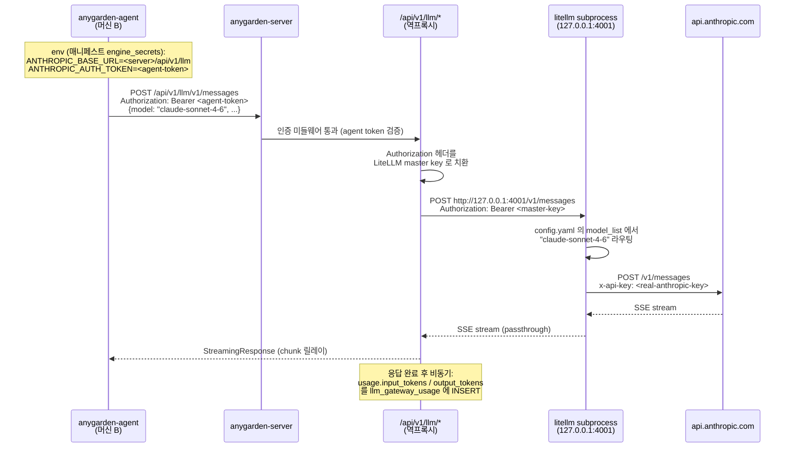
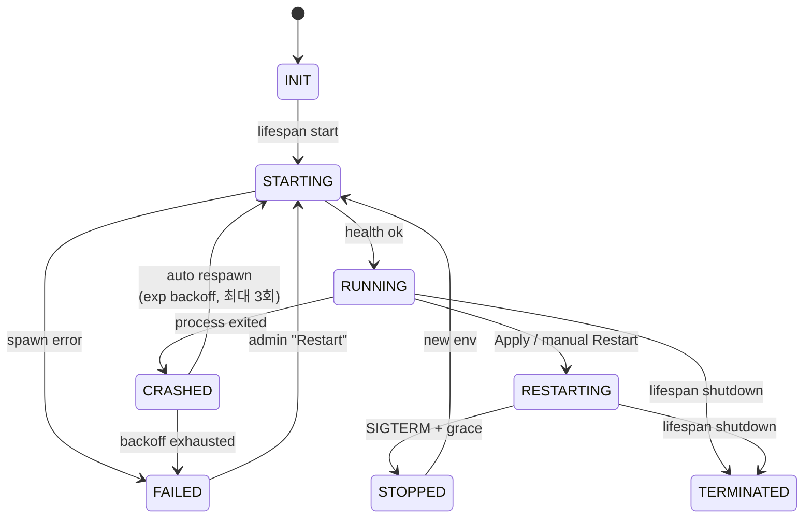

# 12 · LLM Gateway (내장 LiteLLM 서브프로세스)

> anygarden-server 가 LiteLLM Proxy 를 서브프로세스로 내장 관리하고, 모든 에이전트의 LLM 호출이 `/api/v1/llm/*` 역프록시 경로를 경유하게 한다. 이 계층은 §10 Machine 스케줄링 위에 **얹히는** 선택적 계층이며, Feature flag (`ANYGARDEN_LLM_GATEWAY_ENABLED`) 로 on/off 된다.

배경과 대안 비교는 [ADR-004](../decisions/004-embedded-litellm-gateway.md), 상세 구현 계획은 [`.tmp/plan-197-embedded-litellm-gateway.md`](../../.tmp/plan-197-embedded-litellm-gateway.md), 이슈는 [#197](https://github.com/e7217/anygarden/issues/197).

## 12.0 요약

**한 줄**: "anygarden-server 가 LiteLLM 을 자식 프로세스로 돌리고, 에이전트의 LLM 호출은 전부 anygarden 의 `/api/v1/llm/*` 를 거친다."

### 왜 필요한가

§10 까지의 설계는 에이전트 프로세스가 업스트림 LLM API (Anthropic, OpenAI) 로 **직접** 나가는 구조다. 머신에 API 키만 있으면 된다. 이 구조는 세 가지 한계를 만든다:

1. **인터넷 없는 머신은 LLM 을 못 쓴다**. 내부망에 갇힌 머신에서 Claude Code 에이전트를 띄우려면 운영자가 머신마다 프록시를 개별 세팅해야 한다. 머신 수가 늘면 관리 불가능.
2. **사용량 추적이 비어 있다**. 호출이 anygarden 를 거치지 않으므로 룸/에이전트/모델별 집계가 불가능.
3. **프로토콜이 엔진마다 다르다**. Claude Code 는 Anthropic `/v1/messages`, Codex 는 OpenAI `/v1/chat/completions`. 둘 다 커버하려면 단순 reverse proxy 로 부족.

### 무엇으로 푸는가

LiteLLM Proxy (OSS, 1.83+) 가 두 프로토콜을 같은 포트의 서로 다른 path 로 동시 서빙한다. 이를 anygarden-server 의 **서브프로세스로** 묶어서, 설치·운영 아티팩트를 늘리지 않고 기능만 얻는다.

```
[유저/에이전트/머신]
        │ HTTPS
        ▼
┌────────────────────────────────────────────────────┐
│  anygarden-server (FastAPI)                            │
│                                                     │
│   /api/v1/llm-gateway/*  (admin CRUD + Apply)       │
│   /api/v1/llm/*          (에이전트 역프록시)         │
│                                                     │
│   lifespan ────> LLMGatewaySupervisor               │
│                       │ manages                      │
│                       ▼                              │
│   ┌──────────────────────────────────────┐           │
│   │ litellm subprocess                    │           │
│   │   127.0.0.1:4001                      │           │
│   │   --config ~/.anygarden/litellm.yaml     │           │
│   └──────────────────┬───────────────────┘           │
└──────────────────────┼───────────────────────────────┘
                       ▼
             api.anthropic.com / api.openai.com / ...
```

### 핵심 원칙

1. **서브프로세스만, mount 아님**. LiteLLM 의 공식 지원 경로는 CLI 하나. FastAPI `app.mount()` 로 끌어안으면 lifespan/DB/미들웨어가 버전 업마다 깨진다 → [ADR-004](../decisions/004-embedded-litellm-gateway.md).
2. **stateless 운용**. LiteLLM 의 Postgres 의존 기능 (virtual key UI, persistent spend tracking) 은 포기. 사용량은 anygarden SQLite 에 직접 기록.
3. **외부 노출 없음**. LiteLLM 은 `127.0.0.1:4001` 만 listen. 유일한 접근 경로는 anygarden-server 의 역프록시.
4. **드래프트-Apply 패턴**. 설정 수정은 DB 에 쌓이고, admin 이 "Apply" 를 눌러야 respawn. 핫리로드 없음.
5. **Feature flag off 에서 기존 경로 완전 보존**. 이 계층은 선택적.

---

## 12.1 데이터 흐름

### 에이전트가 LLM 호출 하나를 완료하는 전체 시퀀스



### 역프록시 (`reverse_proxy.py`) 의 구현 요점

- **인증**: 기존 `auth/dependencies.py` 의 `Identity` 의존성을 붙인다. user / agent / machine 세 종류 토큰 모두 허용 (admin 전용이 아님 — 에이전트가 실제로 호출해야 함).
- **헤더 치환**: `Authorization` 을 떼고 `Bearer <master-key>` 로 다시 채운다. master key 는 supervisor 기동 시 메모리에 랜덤 생성 + env 로 LiteLLM 에 주입 (DB 에 저장 안 함).
- **스트리밍**: `httpx.AsyncClient.stream()` + FastAPI `StreamingResponse`. SSE 청크 단위 릴레이. `finally` 에서 반드시 `aclose()` 로 upstream leak 방지.
- **usage 파싱**: 응답 body 가 JSON 이면 동기 파싱, SSE 면 최종 `message_stop` 이벤트에서 `usage` 필드 추출. 양쪽 포맷 (Anthropic `usage.input_tokens/output_tokens`, OpenAI `usage.prompt_tokens/completion_tokens`) 모두 지원.
- **비동기 기록**: 파싱된 usage 는 백그라운드 task 로 DB INSERT. 응답 릴레이 자체는 블록되지 않음.

### 사용량 집계

`llm_gateway_usage` 는 요청당 1 행. admin UI 의 Usage 섹션은 SQLite `GROUP BY` 로 on-the-fly 집계 (by model / by agent / by room). 트래픽이 커지면 재평가하되, 초기 범위엔 이걸로 충분.

---

## 12.2 Supervisor 상태 머신



### 상태별 설명

| 상태 | 의미 | 진입 트리거 | 탈출 트리거 |
|---|---|---|---|
| `INIT` | 객체 생성 직후 | - | lifespan start |
| `STARTING` | `subprocess.Popen` 호출 후 health check 대기 | lifespan / respawn / Apply | health ok / health timeout |
| `RUNNING` | 127.0.0.1:4001 에 응답 정상 | health ok | process exit / Apply / shutdown |
| `CRASHED` | `returncode != None` 감지, backoff 중 | watch task | respawn 시도 / backoff 초과 |
| `RESTARTING` | Apply 받아 graceful shutdown 중 | admin Apply / Restart | SIGTERM 완료 |
| `STOPPED` | 프로세스 종료 완료, 새 env 준비 중 | grace 종료 | new env 구성 완료 |
| `FAILED` | 자동 recovery 포기. admin 개입 필요 | spawn error / backoff 초과 | admin Restart |
| `TERMINATED` | 서버 종료 완료 | lifespan shutdown | - |

### 크래시 복구 정책

- 감지: 백그라운드 watch task 가 `proc.returncode` 를 폴링 (또는 `proc.wait()` 후 await).
- Backoff: `[1s, 5s, 30s]` 3 단계 고정. 4 번째 크래시면 `FAILED` 로 남기고 admin 에게 알림 (Status 섹션에 로그 + 빨간 뱃지).
- 자동 재시도 횟수 리셋: `RUNNING` 진입 후 5 분 경과하면 backoff 카운터 0 으로 리셋 (일시적 이슈는 반복 재시도, 영구 이슈는 빨리 포기).

### Graceful shutdown

1. `proc.terminate()` (SIGTERM)
2. `asyncio.wait_for(proc.wait(), timeout=30)`
3. 살아 있으면 `proc.kill()` (SIGKILL)
4. 새 env 구성 (시크릿 복호화) → 새 `subprocess.Popen`

30 초 grace 는 진행 중 SSE 스트리밍이 자연스럽게 끝날 시간. 그보다 오래 걸리는 turn 은 강제 종료되며 에이전트 측에서 timeout 으로 처리.

---

## 12.3 설정 관리 — 드래프트-Apply 패턴

### 두 개의 "설정 상태"

| 상태 | 위치 | 누가 바꾸나 | 누가 읽나 |
|---|---|---|---|
| **적용된 설정** | 현재 LiteLLM 이 로드한 config.yaml 의 hash | admin Apply 시 갱신 | supervisor가 추적 |
| **드래프트** | DB (`llm_gateway_models`, `llm_gateway_secrets`) | admin CRUD API | config_writer 렌더링 대상 |

### pending 판정

```python
pending_count = count_differences(
    applied_config_hash,
    hash(render_config(db_state))
)
```

UI 는 `pending_count > 0` 일 때 Apply 버튼 활성화 + 뱃지 표시.

### Apply 시퀀스

```
admin: POST /api/v1/llm-gateway/apply
  │
  ├─ 1. config_writer.render(db)  →  yaml 문자열
  ├─ 2. atomic write to ~/.anygarden/litellm.yaml
  ├─ 3. supervisor.restart()
  │     ├─ SIGTERM → 30s grace → SIGKILL
  │     ├─ decrypt secrets  →  env 구성
  │     └─ new Popen  →  health check (10s timeout)
  ├─ 4. applied_config_hash = hash(yaml)  (메모리 저장)
  └─ 5. 200 OK 또는 500 (실패 시 이전 상태 유지)
```

실패 시 이전 config.yaml 과 이전 subprocess 를 그대로 둔다. 새 프로세스가 health 체크를 통과하지 못하면 rollback.

### 시크릿이 yaml 에 들어가지 않는 이유

config.yaml 에 API 키 원문이 들어가면:
- 파일을 읽을 수 있는 누구나 (서버 프로세스 user, 백업, 로그 등) 키 노출
- admin 이 UI 에서 키를 수정해도 yaml diff 에 평문이 남음

대신 yaml 은 env 참조만 한다:
```yaml
model_list:
  - model_name: claude-sonnet-4-6
    litellm_params:
      model: anthropic/claude-sonnet-4-6
      api_key: os.environ/ANYGARDEN_LITELLM_ANTHROPIC_API_KEY
```
subprocess spawn 시 `env=` 로 `ANYGARDEN_LITELLM_ANTHROPIC_API_KEY=<복호화된 값>` 주입. 파일엔 참조만, 프로세스 메모리에만 평문.

Fernet 키는 기존 `ANYGARDEN_MCP_SECRETS_KEY` 재사용 — 운영자가 관리해야 할 KMS 키 1 개 유지.

---

## 12.4 Admin UI — 세컨더리 사이드바

### 페이지 레이아웃

```
┌──────────┬──────────────────┬─────────────────────────────┐
│ 메인     │ LLM Gateway      │                             │
│ 사이드바 │                  │ (선택된 섹션 컨텐츠)        │
│          │ ▸ Models         │                             │
│ Rooms    │ ▸ Secrets        │                             │
│ Agents   │ ▸ Status         │                             │
│ Skills   │ ▸ Usage          │                             │
│ MCP      │                  │                             │
│ Machines │ ─────────────── │                             │
│ LLM GW ● │ Status: ● Run   │                             │
│          │ Pending: 3       │                             │
│          │ [Apply (3)]      │                             │
└──────────┴──────────────────┴─────────────────────────────┘
```

### 섹션 별 책임

| 섹션 | 보이는 것 | 바꾸는 것 |
|---|---|---|
| **Models** | 등록된 모델 목록 (이름·provider·upstream·api key ref·enabled) | CRUD (`POST/PATCH/DELETE /models`) + Test (`POST /models/{id}/test`) |
| **Secrets** | env var 이름 + 마스킹된 값 (prefix + 마지막 4자) + 최근 테스트 상태 | CRUD (`POST/PATCH/DELETE /secrets`) + Test (1-token ping) |
| **Status** | PID / uptime / config hash / 마지막 재기동 / listen 주소 | Restart 버튼 (확인 다이얼로그) |
| **Usage** | 24h 윈도우 기본, by model / by agent (top 5) 집계 표 | 읽기 전용, window 드롭다운 (1h/24h/7d) |

하단 고정 푸터 (Apply 버튼) 는 어느 섹션에 있든 보인다. 메인 사이드바의 "LLM Gateway" 항목은 `pending_count > 0` 일 때 오른쪽에 빨간 점(●).

### 권한

- 모든 `/api/v1/llm-gateway/*` 엔드포인트: `Depends(get_admin_identity)` 게이트
- 프런트 `AdminLLMGatewayPage`: `user?.is_admin` 체크로 사이드바 항목과 라우트 가드 둘 다 숨김
- 역프록시 `/api/v1/llm/*` 는 **일반 agent/user 토큰도 허용** (에이전트가 실제로 LLM 을 호출할 수 있어야 함)

### 왜 세컨더리 사이드바인가

섹션이 4 개라 상단 탭으로 쪼개면 한 줄 가득 차고 Apply 버튼을 둘 자리가 없다. 좌측 사이드바 + 고정 푸터 레이아웃은:
- Apply 가 어느 섹션에 있든 일관된 위치에 표시
- 향후 섹션 추가 (e.g. Routing rules, Rate limits) 시 자연스럽게 확장
- DESIGN.md 의 warm neutral + whisper borders 원칙 그대로 적용 가능

---

## 12.5 배포 / 운영

### LiteLLM 설치

`Makefile` 의 `install` 타겟에 `uv tool install 'litellm[proxy]'` 추가. 이 한 줄로:
- `~/.local/share/uv/tools/litellm/` 에 영구 venv 생성
- `~/.local/bin/litellm` 심링크 자동 등록 → PATH 통합
- anygarden-server 의 `subprocess.Popen(["litellm", ...])` 이 wrapper 없이 동작

`uvx` 를 쓰지 않는 이유는 [ADR-004](../decisions/004-embedded-litellm-gateway.md) 의 "Alternatives considered" 참조 (버전 예측성, 실행당 오버헤드 0).

### 환경변수

| 변수 | 기본값 | 설명 |
|---|---|---|
| `ANYGARDEN_LLM_GATEWAY_ENABLED` | `false` | 게이트웨이 기동 여부 |
| `ANYGARDEN_LLM_GATEWAY_PORT` | `4001` | LiteLLM subprocess 의 listen 포트 |
| `ANYGARDEN_LLM_GATEWAY_CONFIG_PATH` | `~/.anygarden/litellm.yaml` | 렌더링된 config 위치 |
| `ANYGARDEN_MCP_SECRETS_KEY` | (기존) | Fernet 키. 시크릿 암호화에 재사용 |

Master key 는 env 로 받지 않고 supervisor 가 부팅 시 `secrets.token_urlsafe(32)` 로 생성해 메모리에 보관. 서버 재시작마다 갱신된다 (외부에 나가지 않는 키이므로 재발급이 안전).

### 파일 배치

```
~/.anygarden/
├── anygarden.db              (기존 — SQLite main)
├── litellm.yaml           (신규 — Apply 때마다 rewrite)
├── agents/
│   └── <agent_id>/        (§10 materialized tree)
└── ...
```

### 로그

- LiteLLM subprocess 의 stdout/stderr 는 anygarden-server 의 logger 에 relay (structlog 로 prefix `llm_gateway.stdout`)
- 역프록시 요청은 `llm_proxy.request` 이벤트로 기록 (agent_id, model, status, duration)
- 사용량 INSERT 는 `llm_gateway.usage_recorded` (필요시 debug 레벨로)

### 크론

`scheduler/lifecycle.py` 에 30 일 TTL 정리 추가:
```python
DELETE FROM llm_gateway_usage
WHERE timestamp < datetime('now', '-30 days')
```

---

## 12.6 에이전트 측 통합 (Phase 5)

현재 `packages/agent/anygarden_agent/secrets.py:135-157` 에 `secrets_in_env` 가 정의·테스트만 되고 production 호출이 없다. 이 계층을 실제로 쓰는 첫 사용자가 게이트웨이다.

### claude-code / codex 어댑터 wiring

```python
# integrations/claude_code.py  (의사코드)
from anygarden_agent import secrets as agent_secrets

async def _collect_reply(self, prompt, options):
    with agent_secrets.secrets_in_env([
        "ANTHROPIC_BASE_URL",
        "ANTHROPIC_AUTH_TOKEN",
        "ANTHROPIC_API_KEY",
    ]):
        # claude-agent-sdk 가 os.environ 에서 이 값을 읽어서 client 구성
        async for event in self._query_fn(prompt, options):
            ...
```

codex 어댑터도 동일 패턴, 키만 `OPENAI_BASE_URL` / `OPENAI_API_KEY` 로.

### 매니페스트 빌더

서버 측 매니페스트 생성에서 `ANYGARDEN_LLM_GATEWAY_ENABLED=true` + "이 에이전트는 게이트웨이 경유" 설정 시:

```python
engine_secrets = {
    "ANTHROPIC_BASE_URL": f"{server_base_url}/api/v1/llm",
    "ANTHROPIC_AUTH_TOKEN": agent.anygarden_token,
    "OPENAI_BASE_URL":    f"{server_base_url}/api/v1/llm/v1",
    "OPENAI_API_KEY":     agent.anygarden_token,
}
```

Feature flag off 이거나 해당 에이전트의 게이트웨이 경유 플래그가 꺼져 있으면 기존 경로 (머신 host env 의 진짜 API key) 그대로 사용.

---

## 12.7 보안 / 위협 모델

### 공격 표면

- **LiteLLM 에 직접 접근**: 127.0.0.1 만 listen → 서버 호스트에 SSH 접근한 공격자만 가능. 그 시점엔 이미 더 큰 문제.
- **역프록시 우회**: 불가능 — 유일한 접근 경로이며 인증 미들웨어 통과 필수.
- **토큰 도난**: 에이전트 토큰이 유출되면 해당 에이전트 명의로 LLM 호출 가능. anygarden 의 기존 토큰 rotation 으로 대응 (게이트웨이 고유 이슈 아님).
- **시크릿 유출**: config.yaml 엔 평문 없음. env 는 서브프로세스 메모리만. `ANYGARDEN_MCP_SECRETS_KEY` 유출 시엔 모든 암호문이 복호화되지만 이는 기존 MCP 시크릿과 동일 threat surface.
- **비용 폭탄**: 토큰 도난 시 admin 이 승인한 모델 한도 내에서 호출. 게이트웨이 단 rate limiting 은 추후 확장.

### 미처리 이슈 (명시)

- 에이전트 간 격리 — 같은 머신의 두 에이전트가 서로의 토큰을 훔칠 수 있는 경로는 여전히 존재 ([#184](https://github.com/e7217/anygarden/issues/184) 에서 일부 완화, MCP subprocess 경로는 여전히 열려 있음). 게이트웨이가 이 문제를 직접 풀지는 않지만, 토큰 → master key 치환 덕분에 **실제 API 키** 는 새지 않는다. 사고 시 복구 비용이 줄어드는 간접 효과.

---

## 12.8 관련 문서

- [ADR-004 — Embedded LiteLLM Gateway](../decisions/004-embedded-litellm-gateway.md)
- [ADR-001 — Engine subprocess](../decisions/001-engine-subprocess.md) — 이 결정의 선례 패턴
- [§10 Machine 스케줄링](./10-machine-scheduler.md) — 이 계층이 얹히는 base
- [§01 전체 아키텍처](./01-architecture.md)
- 구현 계획: [`.tmp/plan-197-embedded-litellm-gateway.md`](../../.tmp/plan-197-embedded-litellm-gateway.md)
- 이슈: [#197](https://github.com/e7217/anygarden/issues/197)
