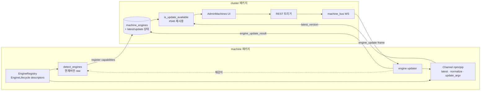

# 엔진 수명주기(Lifecycle) 추상화 — 설계 스케치

- **작성일**: 2026-07-24
- **상태**: 초안(스케치) — 열린 결정 1건 미확정
- **관련 작업**: #545(systemd PATH), #546(PyPI 버전 감지·알림), #550(머신 자기-업데이트)
- **범위**: `packages/machine` 중심, `packages/cluster` 일부. `packages/agent`는 변경 없음.

> 이 문서는 "엔진 최신버전 확인 + 업데이트" 기능을, **추후 엔진 추가를 고려한 추상화** 위에 얹기 위한 설계 스케치다. 코드 블록은 모두 *형태 예시*이며 구현이 아니다.

---

## 1. 배경 & 문제

anygarden은 4개 엔진 어댑터를 지원한다 — `codex-cli`, `gemini-cli`, `claude-code`, `openhands`. 여기에 "엔진 CLI의 최신버전을 확인하고 업데이트하는" 기능을 추가하려 한다.

문제는 **한 엔진의 사실(fact)이 3개 패키지·4곳에 흩어져 있다**는 것이다:

| 무엇 | 위치 | 새 엔진 추가 시 |
|---|---|---|
| 어댑터 등록 (name→module/class) | `agent` · `integrations/__init__.py:24,34` | 2개 dict |
| 감지 + 현재버전 (binary/python-module) | `machine` · `detector.py:35,63` | `BINARY_ENGINES` 또는 `PYTHON_MODULE_ENGINES` 1줄 |
| 모델·추론레벨 카탈로그 | `cluster` · `engines/catalog.py:109` | `ENGINE_CATALOG` 1블록 |
| 설치 힌트 문자열 | `agent` · 각 어댑터 내부 | 어댑터마다 (`codex_cli.py:187` 등) |
| **최신버전 조회 · 업데이트 채널** | **없음** | 이번에 신설 |

새 엔진 하나 = 지금도 최소 3~4곳 동기 수정이고, 하나 빠뜨리면 조용히 실패한다(`detector.py:50-58` 주석이 실제 그 사고를 경고). "엔진이란 무엇인가"를 한 곳에 정의하는 추상이 없다.

---

## 2. 목표 & 비목표

### 목표
- 엔진의 **수명주기**(감지 → 현재버전 → 최신버전 → 업데이트)를 단일 추상으로 응집한다.
- 새 엔진 추가 = **descriptor 1개** (드물게, 새로운 설치 채널이면 `Channel` 구현 1개).
- "최신버전 확인 + 업데이트" 기능이 이 추상 위에 얹힌다.
- 기존 업데이트 오케스트레이션(#550)·버전비교/UI(#546) 인프라를 **재사용**한다.

### 비목표 (YAGNI)
- 런타임 `EngineAdapter` ABC 재설계 — 이미 충분히 추상화됨(`base.py:105`).
- 모델 카탈로그(`catalog.py`)를 라이브 쿼리로 전환 — 의도적 수동관리이며 이번 범위 아님.
- docker / homebrew / 직접 바이너리 다운로드 채널 — *확장점*만 열어두고 구현하지 않음.
- `agent`/`machine`/`cluster` 4곳 전면 통합(단일 God descriptor) — 프로세스 경계를 깨고 리스크만 큼.

---

## 3. 현재 추상화 상태

### ✅ 이미 추상화됨 (건드리지 않음)

| 관심사 | 추상 | 근거 |
|---|---|---|
| 런타임 실행 | `EngineAdapter` ABC — 추상 메서드 `on_message()`/`start()`, 공통 로직은 base 제공 | `base.py:105,125,133` |
| 어댑터 인스턴스화 | `get_adapter(engine)` 팩토리 | `integrations/__init__.py:42` |
| 머신 내 감지 + 현재버전 | `detect_engines()` — binary/python 2전략, `EngineInfo(engine,version,path)` | `detector.py:133` |
| 현재버전 → 서버 보고 | register `capabilities` → `machine_engines` 테이블 → `GET /machines/{id}/engines` | `models.py:443`, `machines.py:484` |
| 모델·추론레벨 | `EngineCatalogEntry` + 조회 헬퍼 | `catalog.py:71` |

### ❌ 추상화 없음 (이번에 채울 곳)

| 관심사 | 현재 상태 |
|---|---|
| 엔진 "정체"의 단일 정의 | 4곳 분산 |
| 설치 채널(npm/pip) 개념 | 힌트 문자열·binary/python 이분법에만 암시 |
| 최신버전 조회 | npm registry 조회 코드 부재 (PyPI 조회는 anygarden 자체 패키지 전용) |
| 버전 문자열 정규화 | `--version` 원문 그대로 저장 (`detector.py:89`) — `"claude 2.1.211"` vs bare `"0.144.1"` |
| 엔진 업데이트 실행 | 없음 (#550 `run_update`는 `venv-pip`+`anygarden-machine` 고정이라 재사용 불가) |

---

## 4. 제안 설계

### 4.1 핵심 개념 3가지

**(a) `Channel` — 설치 채널 추상 (확장점, 지금은 2구현만)**

한 엔진이 "어떻게 설치·조회·업데이트되는가"를 캡슐화한다. `npm`, `pip` 두 구현으로 시작하고, 새 채널은 이 Protocol 구현 하나를 추가하는 것으로 열려 있다.

```python
# machine: anygarden_machine/engines/channels.py  (형태 예시)
class Channel(Protocol):
    async def latest_version(self, package: str) -> str | None: ...   # registry 조회
    def normalize(self, raw: str) -> str | None: ...                  # "claude 2.1.211" → "2.1.211"
    def update_argv(self, package: str, target: str | None) -> list[str]: ...

class NpmGlobal:   # npm i -g <pkg>@<target>,  https://registry.npmjs.org/<pkg>/latest
    ...
class PipVenv:     # <python> -m pip install -U <pkg>[==target],  PyPI JSON
    ...
```

- **정규화는 채널이 소유**한다. npm은 semver, pip는 PEP 440을 알고 있으므로 각 채널이 raw `--version` 문자열에서 비교 가능한 버전을 추출한다.

**(b) `EngineLifecycle` — 엔진 수명주기 descriptor (단일 정의)**

지금 4곳에 흩어진 "정체"를 한 항목으로 모은다. **채널은 단수**로 취급한다(아래 4.5).

```python
# machine: anygarden_machine/engines/registry.py  (형태 예시)
@dataclass(frozen=True)
class EngineLifecycle:
    engine: str                 # "codex-cli"
    detect: DetectSpec          # binary("codex") | module("openhands.sdk", "__version__")
    channel: Channel            # NpmGlobal() | PipVenv()
    package: str                # "@openai/codex" | "openhands-sdk"   ← 허용목록의 소스(4.5)

ENGINE_LIFECYCLES: dict[str, EngineLifecycle] = { ... }
```

**(c) `EngineRegistry` — 파생의 원천**

`detect_engines()`와 업데이트 실행이 **이 레지스트리에서 파생**된다. 기존 `BINARY_ENGINES`/`PYTHON_MODULE_ENGINES`는 `detect` 필드로 흡수된다.

### 4.2 배치 — 어느 패키지에 두나

| 패키지 | 담당 | 비고 |
|---|---|---|
| `machine` | `EngineRegistry`, `Channel` 구현, detector 재배선, 엔진 업데이트 실행 | 엔진 CLI가 실제로 사는 곳. **descriptor의 소유자** |
| `cluster` | 업데이트 REST 트리거, WS 상태 추적, 비교(`is_update_available`), 캐시, UI | #550/#546 인프라 재사용 |
| `agent` | 변경 없음 | 런타임 실행만 담당 |

### 4.3 데이터 흐름



### 4.4 컴포넌트별 변경

| 컴포넌트 | 신규/변경 | 내용 |
|---|---|---|
| `engines/registry.py` | **신규** | `EngineLifecycle` + `ENGINE_LIFECYCLES` |
| `engines/channels.py` | **신규** | `Channel` Protocol + `NpmGlobal`/`PipVenv` |
| `detector.py` | 변경 | `BINARY_ENGINES`/`PYTHON_MODULE_ENGINES` → 레지스트리 `detect`에서 파생 |
| 엔진 updater | **신규** | `channel.update_argv()` 실행. #550 `run_update`와 분리(그건 machine 자기 전용 유지) |
| `protocol/frames.py` | **신규 프레임** | `EngineUpdateFrame`/`EngineUpdateResultFrame` (`self_update` 짝을 모델로, `:192`/`:348`) |
| `daemon.py` | 변경 | `engine_update` case 추가 (`self_update` dispatch 옆) |
| `machines.py` | **신규 엔드포인트** | `POST /machines/{id}/engines/{engine}/update` (`self_update` 트리거 `:336-365` 패턴 복제) |
| `machine_engines` 스키마 | 변경 | `latest_version`, `update_status`, `update_error`, `checked_at` 컬럼 추가 (또는 sibling 테이블) |
| 최신버전 조회 | **신규** | `Channel.latest_version()` — 배치는 §7 열린 결정 |
| 프론트 | 변경 | `AdminMachines.tsx` 엔진 행에 버전/업데이트 버튼·배지 (#546 `StatusBadge` 패턴 이식) |

### 4.5 채널은 단수로 취급 (확정)

`claude-code`는 현실적으로 `claude` 바이너리(npm) + `claude-agent-sdk`(pip)가 얽혀 있지만, **업데이트 대상 채널은 하나로 잡는다** — 감지·버전에 쓰는 그 채널(= 실행에 실제로 쓰이는 `claude` 바이너리). SDK는 `anygarden-agent`의 pip 의존성 축이라 이 기능의 관심사가 아니다. 따라서 `EngineLifecycle.channel`은 단수 필드이며, "한 엔진 = 한 업데이트 채널" 불변식을 유지한다. (복수 채널이 진짜 필요해지면 그때 확장한다 — YAGNI.)

### 4.6 보안 경계 (중요)

#550은 서버가 임의 패키지명을 주입하지 못하도록 `PACKAGE_NAME`을 `anygarden-machine`으로 **고정**했다(의도된 보안 설계). 엔진 업데이트는 서버가 "어떤 엔진"인지 지정해야 하므로 이 불변식을 다음과 같이 계승한다:

- 서버는 WS/REST로 **엔진 키만** 넘긴다 (예: `{"type":"engine_update","engine":"codex-cli"}`).
- 머신 쪽 `ENGINE_LIFECYCLES`가 **엔진 키 → 패키지명 허용목록의 유일한 소스**다. 서버가 넘긴 문자열이 패키지명·설치소스·셸 문자열이 되는 경로는 없다.
- `update_argv()`는 argv 리스트를 만들며 셸을 거치지 않는다(#550 `updater.py`와 동일 원칙).

→ 이것이 descriptor를 `machine`에 두는 또 하나의 강력한 이유다.

---

## 5. 기존 인프라 재사용

| 필요 | 재사용 | 위치 |
|---|---|---|
| 업데이트 WS 트리거 배관 | `machine_bus.send()` + frame dispatch + result handler | `machines.py:357`, `daemon.py`, `machine_handler.py` |
| 프레임 add/dispatch/result 패턴 | `SelfUpdateFrame`/`SelfUpdateResultFrame` 를 모델로 | `frames.py:192,348,377` |
| REST 트리거(offline 409 / 버전검증 400 / owner-or-admin) | `update_machine_daemon` 복제 | `machines.py:336-365` |
| DB 업데이트 상태 라이프사이클 | `Machine.update_status` 패턴을 엔진 단위로 | `models.py` |
| 버전 비교 | `is_update_available()` (PEP 440) | `version_service.py:65` |
| 최신버전 캐시 | `version_store` + `version_checks` 패턴 | `system/version_store.py` |
| 프론트 배지/폴링 | `StatusBadge`, `useUpdateStatus` 패턴 | `AdminSystem.tsx`, `useSystemVersion.ts` |
| 현재버전 감지·저장·노출 | 그대로 사용 | `detector.py`, `machine_engines`, `machines.py:484` |

**신규로 짤 것**: `Channel` 2구현(npm/pip), `EngineLifecycle` 레지스트리, npm registry 조회기, 버전 정규화, 엔진 updater, 새 WS 프레임/REST 엔드포인트, `machine_engines` 스키마 확장, 엔진별 UI.

---

## 6. 새 엔진 추가 시 델타 (설계 검증)

이 추상이 옳은지는 "새 엔진 추가 시 몇 곳을 고치나"로 검증된다:

- **npm 기반 새 CLI 엔진** → `ENGINE_LIFECYCLES`에 1개 + `catalog.py` 모델 블록 + 어댑터 등록. **수명주기는 1항목.** 채널·detector·updater·UI 무변경.
- **pip 기반 in-process 엔진** → 동일하게 수명주기 1항목. 채널 재사용.
- **완전히 새로운 채널**(예: docker) → 이때만 `Channel` 구현 1개 신설 + descriptor 1개.

→ 세 경우 모두 detector 파이프라인·updater 배관·비교·UI는 **불변**이다.

---

## 7. 열린 결정사항

1. ~~채널 단수 vs 복수~~ → **단수로 확정** (§4.5).
2. **최신버전 조회의 위치** — 미확정.
   - **옵션 A (machine)**: `Channel.latest_version()`을 머신이 호출. descriptor·채널이 이미 머신에 있어 응집도 최고. 서버 outbound 불필요. register/온디맨드로 현재+최신을 함께 보고.
   - **옵션 B (cluster)**: #546 `version_service`에 `fetch_npm_latest`를 추가해 서버가 조회. #546과 대칭이고 outbound를 서버로 집중. 단 채널 지식이 cluster로 새어나감.
   - *스케치 저자 lean*: **옵션 A** — "채널이 곧 조회법"이라 `Channel`에 응집하는 게 자연스럽고, 보안 경계(§4.6)와도 일관된다. 최종 결정은 검토 시.

---

## 8. 테스트 전략 (개략)

- `Channel` 구현: `update_argv`/`normalize`를 순수 함수로 단위 테스트(subprocess/네트워크 없이). npm/pip 각각의 raw `--version` 샘플 → 정규화 결과 검증.
- `latest_version`: registry 응답을 httpx mock으로.
- 레지스트리↔detector 파생: 기존 감지 회귀 테스트가 새 파생 경로로도 통과하는지.
- WS 프레임: `self_update` 테스트 패턴을 `engine_update`로 복제.
- 보안: 서버가 넘긴 엔진 키가 허용목록에 없을 때 거부되는지, 임의 문자열이 argv로 새지 않는지.

---

## 9. 향후 확장 (범위 밖, 참고)

- 새 설치 채널(docker/brew) → `Channel` 구현 추가.
- 최신버전 주기적 폴링(현재 #546은 수동/온디맨드) → 조회기가 이미 있으면 스케줄러만.
- 업데이트 성공 확인 자동화 — 업데이트 후 재감지된 `machine_engines.version` 변화로 확정(#550이 `daemon_version` 변화로 하는 것과 대칭).
