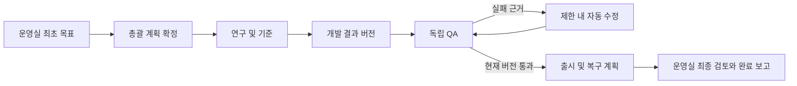

# 프로젝트 목표 실행과 서브룸 자동 협업 구현 계획

기준은 [QA 수용 시나리오](../e2e/2026-09-30-project-room-autonomy-qa.md)와
[전체 안정화 설계](2026-10-01-project-room-autonomy-stabilization-design.md)다.
이 문서는 다음 구현 범위를 제안하며, 구현 완료나 시나리오 통과를 선언하지 않는다.

## 목표와 첫 구현 범위

최종 목표는 사용자가 운영실에 목표와 입력을 한 번 제공하면, 총괄이 담당 서브룸에 위임하고
연구·개발·독립 QA·수정·재검증·출시 준비를 연결한 뒤 운영실에서 검증 가능한 결과를 보고하는 것이다.
커리어 목표도 공고 분석·사실 근거 검토·문서 편집·면접 준비를 같은 실행 계약으로 처리한다.
정보 질문·변경·취소·승인·정기 실행과 모든 한도는 이 실행에 연결되어야 한다.

첫 구현은 **테스트 저장소의 알려진 결함을 수정하고 독립 QA에서 한 번 실패한 뒤 자동 수정과 재검증을
거쳐 운영실에 완료 보고하는 내부 실행**으로 한다. 사용자가 서브룸을 순회하거나 인계를 중계하지 않는다.
서버의 도구·API·durable turn·실제 테스트 명령을 연결한다. 입력과 task ID만 저장하는 변경으로 끝내지 않는다.
이 범위의 완료는 QA-03/04/15/16/21의 해당 경로에 대한 증거이며, 승인·비용 집행이나 두 종합 시나리오
전체의 통과를 대신하지 않는다.

## 현재 코드에서 이어야 할 지점

| 현재 경로 | 확인된 동작 | 필요한 연결 |
| --- | --- | --- |
| `cluster/anygarden/ws/handler.py:ws_room` | 운영실 사용자 메시지에서 응답자를 선택하고 `create_turn`을 호출하지만 보통 `task_id=None` | 한 번의 사용자 요청을 실행과 root Task에 연결하고 최초 총괄 turn을 재사용 |
| `cluster/anygarden/mcp/tools.py:create_task` | 호출자가 **대상 방**의 orchestrator여야 함 | 운영실 총괄이 같은 프로젝트의 담당 서브룸에 위임하는 별도 실행 권한 |
| `cluster/anygarden/mcp/router.py` | agent token으로 도구 호출을 인증함 | 실행 도구에는 실제 turn/attempt/lease/generation을 검증한 호출 맥락 전달 |
| `cluster/anygarden/orchestration/peer_ask.py:_open_turn` | turn ID 없이 최신 open turn을 추정 | 프로젝트 실행에서는 이 추정으로 귀속·권한을 결정하지 않음 |
| `cluster/anygarden/messages/service.py:inject_task_assignment_message` | 입력·선행 결과를 넣은 메시지와 Task에 연결된 turn/outbox 생성 | 실행·입력 버전·stage·산출물 계약·제한을 전달하고 올바른 서브룸에서 깨우기 |
| `cluster/anygarden/task_service.py` | claim/상태 변경 CAS와 성공 선행 작업 검사 | 결과 버전 확정, 실행 이벤트 기록과 완료 게이트를 하나의 상태 변경 경로에 연결 |
| `cluster/anygarden/mcp/tools.py:resolve_task_blockers` | 성공한 선행 작업 결과를 snapshot하고 dependent를 재개 | 수정 전후 결과와 QA 대상 버전까지 검사하고 실행을 재평가 |
| `cluster/anygarden/goals/{scheduler,executor}.py` | 반복 Goal의 slot을 소비하고 Task 생성, 조용한 성공 이력 보존 | 프로젝트 일정은 매 slot마다 별도 ProjectExecution을 생성; 기존 Goal의 일정 의미 유지 |
| `cluster/anygarden/turns/service.py` | turn/attempt/outbox와 재시작 복구 | 후속 총괄 실행도 같은 outbox를 사용하고 실행 취소·한도·입력 revision을 확인 |
| `cluster/anygarden/workspaces/service.py:bind_turn` | write workspace는 claimed source-linked Task를 요구; source message와 wake message 일치 검사 | 위임된 write Task의 실제 권한 원점과 wake 메시지를 구분하는 계약 필요 |
| `cluster/anygarden/usage:write_usage_row` 및 WS lifecycle 사용량 기록 | 주로 agent/room 귀속이며 쓰기 실패를 삼킬 수 있음 | turn/attempt/execution 귀속과 durable 사용량 정산, 미수집 상태 보존 |
| `agent/anygarden_agent/runtime/execution/{contracts,room,codex}.py`와 `handler_wrapper.py` | 엔진 실행·권한·workspace·usage capability 경계 | 실행 범위, deadline, 취소, 호출 전 한도와 외부 효과 차단을 실제 엔진에 적용 |

위 경로의 `cluster/`와 `agent/`는 각각 `packages/cluster/`와 `packages/agent/`를 뜻한다.
REST와 MCP에 서로 다른 orchestration 로직을 추가하지 않고 공용 실행 서비스에서 같은 상태 전이를 집행한다.

## 영속 계약

### 일정 정의와 한 번의 실행

기존 `Goal`은 반복 일정 정의다. 별도 `ProjectExecution`이 한 번의 목표 실행을 나타낸다.
프로젝트 실행 template에는 역할별 담당 서브룸, 내부 허용 작업, 승인 대상, 요구 QA와 한도를 미리 설정한다.
최초 사용자 메시지나 정기 일정은 이 template와 입력으로 실행을 만든다.

`ProjectExecution`의 필수 필드는 다음과 같다.

- 프로젝트, 운영실, 총괄 agent, 요청 사용자, 최초 메시지, root Task 식별자.
- 일정 Goal ID와 실행 slot/context는 정기 실행에서만 설정.
- 목표, 완료 기준, 허용 범위, input revision과 plan revision.
- 고정된 필수 stage 목록, 요구 QA, 현재 상태와 상태 변경 revision.
- 재시도·QA 수정 라운드·위임 깊이·시간·사용량/비용 한도 snapshot.
- 시작 시각, deadline, 대기/실패/중단 이유, 완료 보고 메시지 ID와 완료 시각.
- 사용자 개입 수와 이유는 실제 질문 답변·승인·변경 이벤트로 기록.

상태는 `planning`, `running`, `awaiting_input`, `awaiting_approval`, `limit_reached`, `failed`,
`cancelled`, `completed`를 구분한다. 독립 작업이 계속 실행 가능하면 `running`을 유지하면서
작업별 대기 수와 이유를 함께 제공한다. 일부 작업 완료를 실행 완료로 바꾸지 않는다.

**중요한 마이그레이션 불변식:** 일정에서 시작한 실행의 **root Task만** 기존 `Task.goal_id`를 가진다.
하위 Task는 `execution_id`와 `parent_task_id`를 가지며 `goal_id`를 상속하지 않는다.
현재 `apply_completion`은 `goal_id`를 가진 Task 종료마다 일정의 실패 횟수를 갱신하므로,
하위 작업에 이 값을 복사하면 한 실행의 개별 담당 완료가 일정 성공/실패 횟수를 오염시킨다.
일정 중첩 검사는 root Task를 기준으로 유지하고, root 종료 시에만 일정 bookkeeping을 한 번 수행한다.

### 입력, stage, Task와 결과

- `ExecutionInputRevision`: 최초 자료·사용자 제약·완료 기준의 불변 snapshot. 각 파일은 원본 프로젝트/
  room/file ID, hash, 자료 버전과 접근 가능 여부를 기록한다. 수정은 새 revision을 만든다.
- `ExecutionStage`: `research`, `implementation`, `qa`, `release_preparation`, `synthesis` 등의 필수
  단계. 서버가 sealed manifest를 보관한다. 필수 stage를 끝내기 전에 `completed`를 설정할 수 없다.
- Task 확장: `execution_id`, `parent_task_id`, `stage_id`, `input_revision`, 서버 계산 depth,
  QA iteration, 위임 key, 출력 계약. 작업 그래프 순환과 다른 실행/프로젝트 부모를 거부한다.
- `TaskResult`: result revision, 본문, 실제 산출물 참조와 hash, 검증 근거, 작성 agent/attempt,
  입력 revision, 완료 시각. 재시도나 재작업으로 기존 결과를 덮어쓰지 않는다.
- QA 결과: verdict, 검사한 산출물 버전, 검사 항목/명령/실제 결과, 재현 절차와 실패 근거.
  QA Task가 수행을 마쳤다는 사실과 제품 QA verdict가 통과라는 사실을 구분한다.
- `ExecutionEvent`: 실행 상태·인계·질문·승인·한도·완료의 영속 기록. event key에 UNIQUE 제약을
  두며, 후속 실행을 만드는 event/outbox도 같은 트랜잭션에서 저장한다.

필수 stage는 결과가 만족될 때 완료된다. 첫 QA 실패 Task는 실패 근거로 계속 남기고,
수정 Task와 두 번째 QA Task를 해당 stage의 새 iteration으로 연결한다. 이전 실패를 삭제하거나
필수 작업 목록에서 임의로 제외하여 완료 조건을 만족시키지 않는다.

## 호출 권한과 한 번의 최초 요청

새 실행 도구는 agent token만으로 부모/실행을 신뢰하지 않는다. 실행 중인 turn의 `request_id`,
attempt, lease, generation과 Task를 서버에서 확인한다. 가능하면 엔진 invocation에 제한된 도구
자격증명을 전달하고, 최소 구현에서도 명시적 turn proof를 검증한다. 여러 프로젝트에서 공유되는
agent의 최신 turn을 추정해 부모나 프로젝트를 선택하지 않는다.

제안 도구/API는 같은 서비스 함수를 호출한다.

1. `begin_project_execution`: 총괄이 운영실 사용자 목표를 받았을 때 호출한다. 원본 사용자 메시지와
   활성 총괄 turn을 검증하고 실행/root Task를 생성하며 현재 turn에 root Task를 연결한다.
   새 총괄 turn을 추가로 깨우지 않는다. 동일 source message/client request 재전달은 같은 실행을 반환한다.
2. `delegate_project_task`: 현재 실행과 부모, stage key, 대상 서브룸/담당자, 목적·입력 참조·출력·완료
   기준·성공 선행 작업을 받는다. `(execution, input revision, stage key, iteration)`을 중복 방지 key로 쓴다.
3. `seal_project_plan`: 필수 stage와 의존성, 독립 QA 담당, 자동 수정 규칙을 확정한다. 미확정 계획,
   비어 있는 필수 결과, 다른 프로젝트 입력과 순환 의존성을 거부한다.
4. 기존 `mark_task_status`의 실행 Task 경로 또는 `complete_project_task`: 불변 결과와 증거를 저장하고
   실행 재평가 이벤트를 생성한다. root Task의 단순 `done`은 완료 게이트를 통과해야 한다.
5. `report_project_qa`: 정확한 검사 대상 버전과 verdict/증거를 받는다. 작성자와 같은 agent의 QA,
   오래된 산출물 QA, 증거 없는 성공 보고를 완료 근거로 인정하지 않는다.
6. `complete_project_execution`: 최종 요약·산출물·검증 근거·제한사항·다음 행동을 제출한다.
   서버가 모든 필수 stage와 최종 버전 QA를 확인한 뒤 완료와 운영실 최종 보고를 한 번 저장한다.

HTTP 생성/조회/질문 답변/승인/취소 API도 제공하고 운영실 화면에서 실행과 하위 Task를 조회한다.
작업 카드에 담당자, 원래 요청, 입력 버전, 선행/후속 작업과 실제 산출물 링크를 표시한다.

위임 권한은 운영실 총괄에서 **같은 프로젝트의 허용된 자손 서브룸**으로 제한한다.
총괄이 대상 서브룸의 orchestrator가 아니라는 이유로 위임을 막지 않으며, 위임을 위해 자동으로
일반 room membership을 늘리지 않는다. 담당자는 이미 해당 방의 실행 가능한 agent participant여야 한다.
다른 프로젝트, DM, archived room, 허용되지 않은 담당자와 잘못된 부모를 거부한다.

## 자동 인계와 독립 QA 게이트

- 선행 결과는 task/result ID·hash·입력 revision으로 전달한다. 실패하거나 자료가 없으면 해당
  dependent를 대기시키고 추측으로 메우지 않는다. 독립 단계는 계속 실행한다.
- 각 완료 이벤트는 공용 `reconcile_execution`을 호출한다. 후속 Task와 turn 생성은 영속 key로
  중복을 막는다. 이벤트 재전달·서버 재시작·늦은 이전 attempt 응답도 같은 결과를 유지한다.
- QA 실패는 재현 근거를 포함한 repair Task를 자동 생성한다. 담당자는 원래 개발 담당이며,
  수정 결과에서 새 산출물 버전을 확정한 뒤 QA 담당을 다시 깨운다.
- QA 담당 agent는 검사 대상 결과 작성 agent와 달라야 한다. 최종 수정 버전과 QA 검사 대상이
  일치해야 release preparation과 synthesis를 허용한다.
- root 총괄 Task는 담당자 작업 대기 중 `blocked`와 구체적 이유를 가진다. 모든 담당자 완료마다
  무조건 총괄 모델을 호출하지 않고, 계획된 후속 stage·QA 실패 처리·최종 취합 시점에만 깨운다.
- 완료는 sealed 필수 stage, 현 input revision, 현 산출물 QA, 최종 보고의 저장까지 확인한다.
  완료 뒤에는 새로운 위임·후속 turn·모델 호출을 거부한다. 출시 준비 완료와 미승인 실제 출시는 구분한다.

## 실제 실행 경계와 한도

서버 도구의 allowlist나 프롬프트만으로 범위와 비용이 집행된다고 주장하지 않는다.
엔진이 unrestricted shell과 네트워크를 가지면 `git push`, 제출·배포와 별도 모델 호출로 도구 검사를
우회할 수 있다. 아래 경계를 실제로 연결하고, 지원하지 않는 조합은 실행 전에 명확히 거부/대기시킨다.

- 내부 작업: 허용된 테스트 workspace와 파일 범위, 명령/네트워크 정책을 invocation에 전달한다.
  write 작업은 허용된 현재 Task·입력 revision·workspace epoch로만 시작한다.
- 현재 workspace 검사에서 요구하는 claimed source-linked Task 계약을 유지하면서, 위임의 원본
  사용자 허가와 작업을 깨우는 합성 메시지를 별도 관계로 표현한다. 일치 검사를 단순 제거하지 않는다.
  대기인 Task의 실행 전에 서버가 assignee claim을 확정하는 경로를 마련한다.
- 외부 실행: 제출·push·병합·배포는 범위가 있는 action intent와 승인 broker를 통해 수행한다.
  runtime의 직접 네트워크/credential/command 경로로 우회하지 못하도록 adapter·workspace 정책을 적용한다.
- 재시도: 실행 설정의 max retry와 backoff를 durable Task attempt에 적용한다. AgentTurn transport retry와
  엔진 내부 retry를 합산하며 재시작으로 횟수를 초기화하지 않는다. 영구 인증/입력 오류는 즉시 보고한다.
- QA rounds/depth: 서버가 iteration/depth를 계산하고 하위 위임과 자동 수정 생성 전에 CAS로 검사한다.
- 시간: 실행 deadline을 모든 Task/turn/engine invocation에 전달하고 호출 전·실행 중에 집행한다.
  한도 도달 후 신규 위임·turn과 모델 호출을 막으며 이미 시작한 처리의 중단 결과를 기록한다.
- 사용량/비용: `execution_id`, turn, attempt, 모델 호출 ID로 귀속한다. 호출 전에 실행 전체의 budget을
  예약하고 하위 호출·재시도 포함해 정산한다. measured/estimated/unknown을 별도로 저장한다.
- CLI 한 turn이 여러 모델 호출을 수행할 수 있으므로, handler wrapper의 turn 시작 검사만으로
  **모델 호출별 토큰/비용 hard stop**을 증명하지 않는다. 엔진 callback 또는 계측된 provider gateway와
  runtime egress 경계를 사용해야 한다. 정산 실패는 0 사용량이 아니라 unknown으로 보존한다.
- adapter capability가 설정한 엄격한 한도를 보장하지 못하면 제한을 낮춰 통과로 기록하지 않는다.
  사용자에게 필요한 조건과 미집행 한도를 보고하고 해당 경로를 미구현/차단으로 남긴다.

## 질문·승인·변경·취소의 후속 계약

이 항목은 첫 내부 실행 이후에도 전체 완료에 필요한 범위로 유지한다.

- 질문은 execution/task/input revision과 dedup key, 필요한 사실·질문 이유·영향을 저장한다.
  운영실 답변은 원래 담당 Task에만 전달하며 일부 요청만 답변해도 해당 단계만 재개한다.
- 승인은 action intent·대상·내용·영향·산출물 hash·입력 revision·사용자와 시각을 저장한다.
  미응답·거절·다른 버전의 승인은 실행 권한이 아니다. 외부 효과는 action idempotency key로 한 번만 수행한다.
- 입력 변경은 새 revision과 변경 범위를 기록하고 관련 결과/QA를 무효화한다. 이전 결과는 이력으로 보존하며
  오래된 turn/도구 완료가 현재 revision의 상태를 갱신하지 못하도록 CAS로 차단한다.
- 취소·한도 중단은 새 위임·outbox delivery·재시도·모델 시작을 모두 차단한다. 진행 중 프로세스를 중단하고
  취소 확인, 완료 전에 이미 발생한 효과, 취소할 수 없는 효과를 각각 보고한다.
- 질문·승인·결과는 실행 event에서 받은편지함에 투영한다. 일반 진행은 Task별 최신 상태로 묶고
  질문/승인을 별도 유지한다. 다른 프로젝트의 자료나 알림으로 연결하지 않는다.

## 첫 구현 순서와 권장 코드 분할

1. **계약과 마이그레이션:** 실행·입력 revision·stage·result·event, Task lineage와 unique key.
   적용 시 현재 Alembic head의 다음 번호를 사용하고 이미 적용된 migration을 수정하지 않는다.
   기존 room Task와 일반 반복 Goal은 nullable 실행 FK로 호환한다. goal_id는 root에만 설정한다.
2. **공용 서비스와 도구:** `project_executions/service.py`의 begin/delegate/seal/result/QA/reconcile/finish.
   API·MCP 모두 이 경로를 호출하고 실제 turn proof를 검증한다. 운영실 최초 turn을 중복 생성하지 않는다.
3. **실제 전달과 실행:** assignment와 durable outbox, workspace claim/허가 원점, 입력 파일 접근,
   engine invocation scope를 연결한다. 운영실에서 하위 Task와 상태를 조회하도록 API/UI를 연결한다.
4. **QA 실패 루프와 최종 보고:** 알려진 결함의 첫 QA 실패→repair→새 버전 QA→출시/복구 계획→최종
   검토. 필수 stage와 정확한 QA 버전 게이트, 완료 보고 once key를 집행한다.
5. **집행과 복구:** execution limits를 위임·turn delivery·재시도·엔진 시작에 연결한다. 취소·deadline과
   depth/round/retry를 실제로 검증한다. 계측 불가능한 usage는 unknown으로 표시한다.
6. **전체 확장:** 버전 변경/질문/승인 broker·받은편지함·모델 호출별 사용량 집행·정기 실행을 연결하고
   커리어와 개발의 협업/자동 운영 종합 시나리오를 모두 실제 검증한다.

공용 서비스/모델 담당, agent 실행 경계 담당, API·운영실 표시 담당과 테스트 담당의 소유 파일을
분리할 수 있다. 상태 변경 불변식은 서비스가 소유하며 각 surface에 재구현하지 않는다.

## 첫 구현의 필수 검증과 권위 있는 증거

단위 테스트만으로 아래 경로가 동작했다고 판정하지 않는다. API와 MCP 요청, durable delivery,
actual worker attempt, 테스트 저장소 파일과 명령 결과까지 연결된 integration test를 만든다.
결정론적 테스트 worker는 제어된 실패를 만드는 용도이며, 실제 엔진 종합 실행도 별도 수행한다.

| 검증 | 실행 방법과 필수 증거 |
| --- | --- |
| 최초 목표 한 번 | 운영실 WS로 멘션 없는 요청 한 번 전송; 정확한 총괄 turn, 실행/root Task 하나, 이후 사용자 메시지 0 |
| 도구와 서브룸 위임 | 인증된 MCP `begin/delegate/seal` 호출; 운영실 총괄이 대상 방 orchestrator가 아니어도 올바른 worker Task/turn/outbox 생성 |
| lineage와 원본 범위 | 실행/부모/stage/input revision이 모든 Task/turn/result에 연결; 하위 goal_id=NULL, 일정 root만 goal_id 보유 |
| 입력 전달 | 자료 hash·고유 표시·사용자 제약을 assignment와 실제 worker 입력에서 확인; 다른 프로젝트 파일 참조는 거부 |
| 성공 선행 작업 | 연구 미완료/실패 때 개발 호출 없음; 연구 성공 후 정확한 result revision/hash가 개발 입력에 포함 |
| 독립 실제 QA | 테스트 저장소에 결함 준비; 독립 담당이 테스트 명령을 실행하고 실제 실패 출력/재현 근거와 검사 버전 저장 |
| 자동 수정·재검증 | 사용자 요청 없이 repair Task와 새 output revision 생성; 동일 결함과 관련 회귀가 실제 재실행되어 통과 |
| write workspace | delegated Task로 실제 허용 workspace 수정 가능; 미claim/다른 epoch/프로젝트/버전에서는 실행 거부; 검사 우회 변경 없음 |
| 거짓 완료 거부 | 일부 필수 작업 미완료, QA 미통과, 오래된 결과 QA, 개발자 자신의 QA, 미sealed 계획에서 root 완료 API/MCP 거부 |
| 최종 보고 | 운영실에 목표·담당 결과·실제 산출물 링크·검증 근거·제한사항·다음 행동이 한 번 표시; 링크 파일 hash와 최종 QA 버전 일치 |
| 중복·재시작·늦은 응답 | 같은 delegate/result/QA/완료 event 재전달 및 서버 재시작; 작업/모델 호출/보고 중복 없음; 이전 attempt/version 응답 무효 |
| 완료 뒤 정지 | 완료 후 delivery/reconcile/추가 delegate 시도와 일정 시간 관찰; 추가 모델 호출·위임 없음 |
| round/depth/retry/time | 각 제한을 작게 설정하고 초과 경로 발생; 마지막 허용 시도와 이후 새 호출 0을 실제 runtime/event로 증명 |
| 사용량 정확성 | 하위 작업과 재시도 포함한 measured/estimated/unknown 표시; CLI/gateway가 미지원인 hard stop은 통과로 표시하지 않음 |
| 외부 범위 제외 | 테스트 remote/수신처와 runtime 감사로 push·병합·제출·운영 배포 0 확인; unrestricted shell 우회가 가능하면 scope 집행 통과 아님 |

회귀는 기존 task 권한/claim/blocker, room 파일·산출물 격리, durable turn/retry, schedule slot과
silent-success history, migration upgrade/downgrade와 UI 테스트를 포함한다.
프로젝트 실행 생성/중복, 리드의 위임 권한, QA 버전 게이트와 한도 예약은 race test도 포함한다.

최종 실행 기록에는 서비스 commit, 엔진/모델·브라우저, 테스트 저장소/입력 revision, 실행 ID,
Task/turn/attempt ID, 자동 인계와 상태 전이, 사용자 개입 수, 실제 파일·테스트 명령 결과,
사용량의 측정 상태와 한도 집행 결과를 남긴다. 비밀값과 실제 개인정보는 기록하지 않는다.

첫 구현은 실제 API/도구/엔진 경로의 해당 기대 결과를 모두 확인했을 때만 완료한다.
전체 사용자 목표는 QA-01~21과 네 종합 시나리오의 요구별 현재 증거가 마련될 때까지 유지한다.
